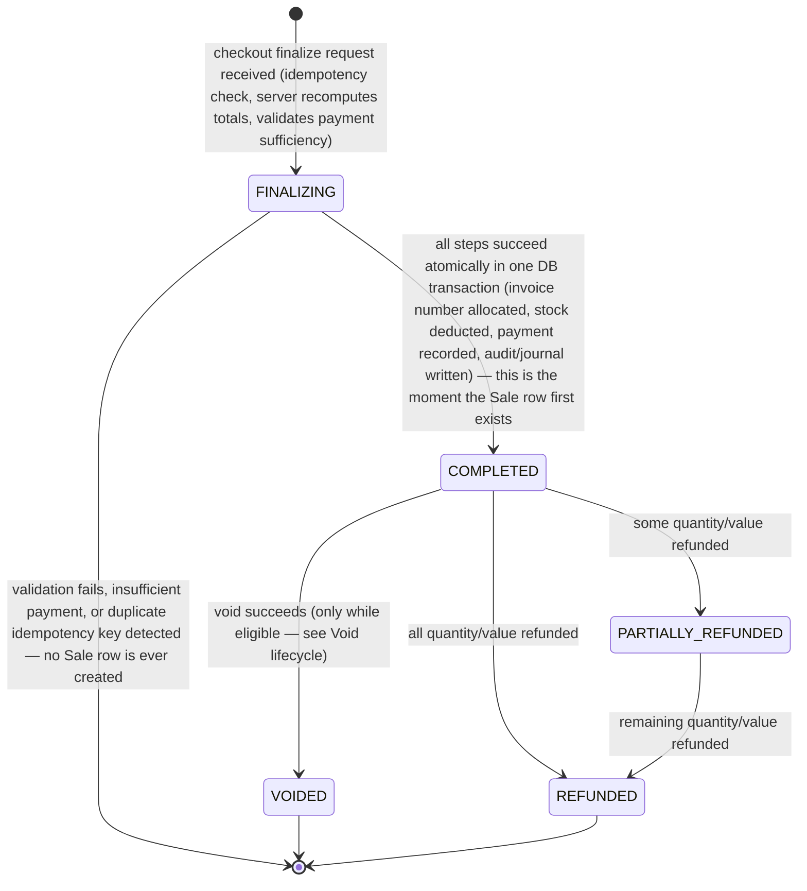
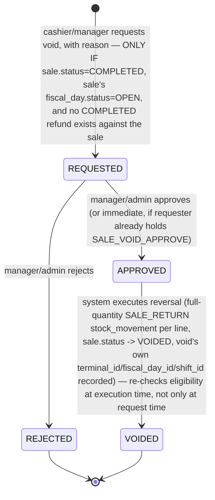
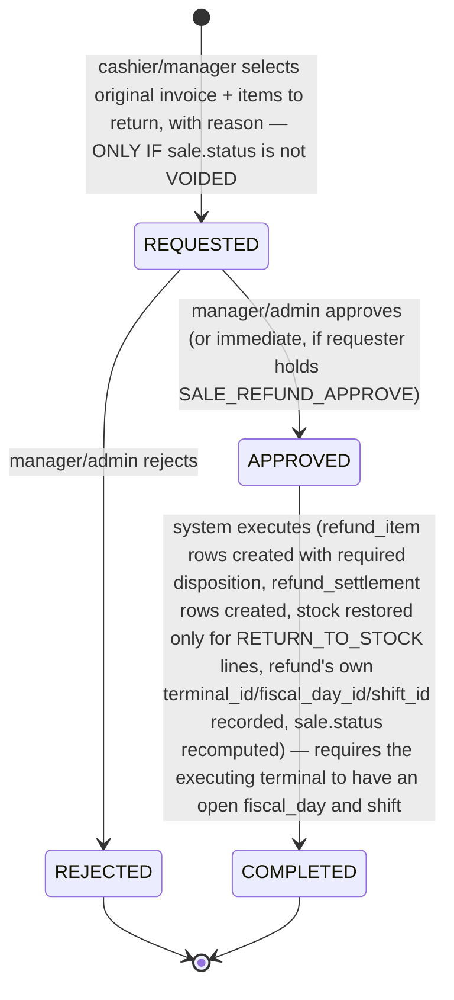

# State Machines — TindaFlow POS

## Status
APPROVED — Stage 2 baseline (`stage-2-baseline`), amended 2026-09-16 for
a fourth time, prompted by a Stage 4 remediation-pass semantic review
rather than a Stage 2-originated finding. Companion to
[domain-model.md](domain-model.md) and [invariants.md](invariants.md).
Diagrams use Mermaid `stateDiagram-v2` syntax. **Pass 1 removed the
persisted `DRAFT` sale state, added the Fiscal Day lifecycle, updated
Shift to reference Fiscal Day, and updated the Void diagram with the
eligibility gate. Pass 2 added a note to the Refund lifecycle clarifying
that refund amounts derive from the finalized per-line snapshot
(DISC-004), never a recalculation. Pass 3 adds processing-context
population (`terminal_id`/`fiscal_day_id`/`shift_id`) to both the Void
and Refund execution transitions, and `refund_settlement` creation to the
Refund execution transition. Pass 4 (this update) corrects the Void
lifecycle's execution-time-recheck-failure note: it previously said a
failed recheck automatically moves the void to `REJECTED`
("system-rejected") — corrected to leave the void `REQUESTED`, since a
failed approval attempt is not itself an authorized decision that the
request should never proceed. This surfaced during Stage 4's API design
of `POST /voids/{voidId}/approve`, when the API contract's own error
semantics needed to describe this precisely and the original wording
was found to conflate "this attempt didn't succeed" with "this request
is permanently declined."**

---

## 1. Sale lifecycle (revised — no persisted DRAFT)



**Notes:**

- **`FINALIZING` is not a stored `sale.status` value** — it is the
  in-flight finalize-sale transaction/service call, shown here to make
  explicit that the authoritative `sale` row does not exist until the
  transaction commits into `COMPLETED`. If finalization fails for any
  reason, the transaction rolls back and **no `sale` row was ever created**
  — there is nothing to clean up, no orphaned `DRAFT` row, and no
  consumed invoice number (see [invariants.md](invariants.md) #6, #14).
- The persisted `sale.status` enum is exactly `COMPLETED` | `VOIDED` |
  `PARTIALLY_REFUNDED` | `REFUNDED` — matching
  [domain-model.md §2.7](domain-model.md) exactly.
- An in-progress shopping cart before checkout is client-side state (React
  state / `localStorage`), never a `sale` row — see
  [domain-model.md §2.11](domain-model.md) for the explicit list of things
  a future server-side cart-recovery feature must never do.
- `COMPLETED → VOIDED` and `COMPLETED → {PARTIALLY_REFUNDED, REFUNDED}` are
  mutually exclusive terminal paths: `VOIDED` cannot be followed by a
  refund transition, and a sale with any completed refund cannot
  subsequently be voided (see [invariants.md](invariants.md) #25, #29).

## 2. Void lifecycle (revised — explicit eligibility gate)



**Notes:**

- **Eligibility is re-checked at both request time and execution time**
  (the `APPROVED → VOIDED` transition), because a fiscal day could close,
  or a refund could be separately approved, in the window between a void
  being requested and being approved. **(revised — Stage 2 amendment
  pass 4, correcting the previous wording below)** If eligibility no
  longer holds at execution time, the transition fails with a stable
  domain-conflict error (e.g. a `SALE_NOT_VOIDABLE`-class condition) —
  the `void` row **remains `REQUESTED`**, it is never automatically
  moved to `REJECTED`. A failed execution attempt is not itself an
  authorized decision that the request should never proceed: only an
  explicit `REQUESTED → REJECTED` action (a human, capability-holding
  decision — see above) or a later, successful approval attempt ever
  resolves a `REQUESTED` void. ~~Previously this note said a failed
  recheck moves the void to `REJECTED` ("system-rejected, with a reason
  recorded")~~ — that was incorrect: RMO 24-2023 constrains *when* a
  fiscal adjustment may take effect, not what a *failed attempt* to
  authorize one does to the request's own state, and TindaFlow has no
  separate reason to auto-resolve a still-live request just because one
  approval attempt against it didn't succeed.
- **(new — Stage 2 amendment pass 3) The `APPROVED → VOIDED` transition is
  also where `void.terminal_id`/`fiscal_day_id`/`shift_id` are populated**
  — the *executing* terminal's own currently-open fiscal day and shift
  (condition 6, [domain-model.md §2.8](domain-model.md);
  [invariants.md](invariants.md) #67/#69), independent of the original
  sale's own `terminal_id`/`fiscal_day_id`/`shift_id`. If the executing
  terminal has no open fiscal day/shift at this moment, the transition
  fails with a stable domain-conflict error the same way — the void
  **remains `REQUESTED`**, distinct from (and checked in addition to) the
  five request-time eligibility conditions.
- See [domain-model.md §2.8](domain-model.md) for the full five-condition
  eligibility policy and its explicit disclaimer: **this is TindaFlow
  product policy, not a universal BIR statutory rule.**
- A `REJECTED` void does not prevent a later, separate void request against
  the same sale (a new `void` row) — but per
  [invariants.md](invariants.md) #21, only one row for that `sale_id` may
  ever reach `VOIDED`.
- Every transition writes an `audit_event`: `SALE_VOID_REQUESTED` on entry
  to `REQUESTED`, `SALE_VOIDED` on entry to `VOIDED`, `SALE_VOID_REJECTED`
  on entry to `REJECTED`.

## 3. Refund lifecycle (shape unchanged; refund-basis note added in pass 2; processing context/settlement added in pass 3)



**Notes:**

- A single `sale` may be the target of multiple, separate refund workflows
  over time (successive partial returns) — each is its own instance of
  this state machine.
- **New precondition on entry to `REQUESTED`:** a refund cannot be
  requested against a sale whose `status = VOIDED` (see
  [invariants.md](invariants.md) #29) — a voided sale has already been
  fully reversed and is not a valid refund target.
- `COMPLETED` here triggers the sale-level status recalculation shown in
  §1 (`PARTIALLY_REFUNDED` vs. `REFUNDED`), computed from cumulative
  accepted-refund history across *all* refunds against that sale.
- Every `refund_item` created during `APPROVED → COMPLETED` carries a
  required `disposition` (`RETURN_TO_STOCK`|`DAMAGED`|`EXPIRED`|
  `DISPOSED`) — only `RETURN_TO_STOCK` produces a restocking
  `stock_movement` (see [invariants.md](invariants.md) #30).
- **(new in pass 2) The amount computed during `APPROVED → COMPLETED`
  derives exclusively from the original `sale_item`'s finalized
  `net_line_amount`** (which already bakes in its allocated order-level
  discount and line-level discount — see
  [domain-model.md §2.7](domain-model.md)'s Order-level discount
  allocation and [invariants.md](invariants.md) DISC-004). The system
  never re-divides `sale.order_level_discount_amount` again at refund
  time and never consults the product's current price or tax
  configuration. For a partial-quantity return, the amount uses the
  cumulative-recompute-then-subtract rule in
  [domain-model.md §2.9](domain-model.md), so that fully returning a line
  across one or more partial refunds always sums to exactly that line's
  `net_line_amount` (DISC-005).
- **(new — Stage 2 amendment pass 3) The `APPROVED → COMPLETED` transition
  also populates `refund.terminal_id`/`fiscal_day_id`/`shift_id`** (the
  executing terminal's own currently-open fiscal day and shift —
  [invariants.md](invariants.md) #67/#69) **and creates one or more
  `refund_settlement` rows** recording how the money is actually returned
  (`CASH`/`GCASH`/`MAYA`/`CARD`/`OTHER`, [domain-model.md §2.9](domain-model.md)),
  summing exactly to `refund.refund_total` (#70). Unlike Void, Refund has
  no eligibility condition requiring the *original* sale's fiscal day to
  still be open — but it has the same requirement as Void that the
  *executing* terminal's own fiscal day/shift be open at this moment
  (#69), so a refund processed against a sale from a prior, closed fiscal
  day is still attributed to today's processing context, never
  retroactively inserted into the original closed day.

## 4. Fiscal Day lifecycle (new)

```mermaid
stateDiagram-v2
    [*] --> OPEN: terminal's business day begins (first shift of the day opens, or an explicit "open day" action — implementation detail for Stage 5)
    OPEN --> OPEN: shifts open/close within the day; sales, voids, refunds, cash movements, X-Readings all occur/attach here
    OPEN --> CLOSED: end-of-day closure requested AND all shifts referencing this fiscal_day are already CLOSED — Z-Reading generated atomically with this transition
    CLOSED --> [*]
```

**Notes:**

- Entry to `OPEN` requires no other `OPEN` `fiscal_day` exists for this
  `terminal_id` ([invariants.md](invariants.md) #32).
- `OPEN → CLOSED` is rejected if any `shift` with `fiscal_day_id` pointing
  at this row still has `status = OPEN` ([invariants.md](invariants.md)
  #36) — every cashier must be closed out before end-of-day.
- The `z_reading` row is created in the **same transaction** as the
  `OPEN → CLOSED` transition — a fiscal day is never left `CLOSED` without
  exactly one `z_reading`, and there is no path to generate a second one
  for the same `fiscal_day` ([invariants.md](invariants.md) #42).
- **`business_date` is a label, not a calendar-date gate** — a store open
  past midnight has one `fiscal_day` spanning both calendar dates. Nothing
  transitions this state machine based on the wall-clock date crossing
  midnight; only an explicit close action does.
- There is no transition back to `OPEN` from `CLOSED`. The next business
  day is a **new** `fiscal_day` row for that terminal.

## 5. Shift lifecycle (revised — references Fiscal Day)

```mermaid
stateDiagram-v2
    [*] --> OPEN: cashier opens shift at a terminal (opening_cash counted and entered) — requires an OPEN fiscal_day for this terminal, and no other OPEN shift for this cashier or this terminal
    OPEN --> OPEN: cash_movement (CASH_IN / CASH_OUT); sales/refunds attributed here; X-Reading may be pulled on demand at any point without changing this state
    OPEN --> CLOSED: cashier declares counted cash; system computes expected_cash and variance; an X-Reading is generated as part of closing
    CLOSED --> [*]
```

**Notes:**

- Entry to `OPEN` requires: an `OPEN` `fiscal_day` exists for this
  terminal (a shift cannot start before the business day is open); no
  other `OPEN` shift exists for this `terminal_id`; no other `OPEN` shift
  exists for this `cashier_id` ([invariants.md](invariants.md) #33, #34,
  #35).
- The close workflow orders cash entry before disclosure: the cashier
  enters `declared_cash` **before** the system reveals `expected_cash` (a
  process constraint enforced in the Stage 7 UI flow, per the governing
  brief).
- `expected_cash`, `cash_sales`, `non_cash_sales`, `refunds_total`,
  `cash_in_total`, `cash_out_total` are computed at the `OPEN → CLOSED`
  transition from the ledger of sales/refunds/cash movements attributed to
  this shift — never entered by the cashier.
- **An `x_reading` may also be generated at any point while `status =
  OPEN`**, on demand, without affecting this state machine at all — it is
  a side read, not a transition (see §6).
- There is no transition back to `OPEN` from `CLOSED`. A new work period
  is a new `shift` row, even if it's the same day/terminal/cashier.

## 6. X-Reading and Z-Reading generation (event diagrams, not lifecycles)

Readings don't have their own multi-state lifecycle — each row is created
once, fully formed, and never changes — so they're shown here as generation
events relative to their owning aggregate's lifecycle, not as a
`stateDiagram`.

```mermaid
sequenceDiagram
    participant Cashier
    participant Shift
    participant FiscalDay
    participant Ledger as Sale/Payment/Void/Refund/CashMovement

    Cashier->>Shift: request X-Reading (any time while OPEN)
    Shift->>Ledger: aggregate transactions for this shift's range
    Ledger-->>Shift: computed totals
    Shift->>Shift: append x_reading row (append-only, totals_snapshot)
    Note over Shift: shift.status unchanged; nothing reset

    Cashier->>Shift: close shift (declare cash)
    Shift->>Ledger: aggregate transactions for this shift's range
    Shift->>Shift: append x_reading row (closing X-Reading) + shift.status = CLOSED

    Note over FiscalDay: later, once ALL shifts for the day are CLOSED
    Cashier->>FiscalDay: request end-of-day closure
    FiscalDay->>FiscalDay: verify no OPEN shift references this fiscal_day (else reject)
    FiscalDay->>Ledger: aggregate transactions for this fiscal_day's full range
    FiscalDay->>FiscalDay: append z_reading row (exactly one) + fiscal_day.status = CLOSED
```

**Notes:**

- An `x_reading` can be generated multiple times per shift (on-demand pulls
  plus the closing one); a `z_reading` is generated exactly once per
  `fiscal_day`, at closure ([invariants.md](invariants.md) #42, #43).
- Both readings are computed from the same underlying ledgers
  (`sale`/`payment`/`void`/`refund`/`cash_movement`) — an `x_reading`
  scoped to one `shift_id`'s transaction range, a `z_reading` scoped to one
  `fiscal_day_id`'s full range (which may span several shifts).
- Neither reading is ever read back as an input to any other calculation —
  see [invariants.md](invariants.md) #40.

## 7. Invoice numbering allocation (sequence diagram)

Unchanged from revision 1 — invoice allocation isn't a multi-state
lifecycle either (a number is "not yet allocated" or "allocated,
permanently"), but the concurrency behavior is worth spelling out:

```mermaid
sequenceDiagram
    participant T1 as Terminal A (finalize sale)
    participant T2 as Terminal B (finalize sale)
    participant DB as PostgreSQL (invoice_series row)

    T1->>DB: BEGIN; SELECT ... FOR UPDATE (invoice_series WHERE store_id=X AND status='ACTIVE')
    activate DB
    T2->>DB: BEGIN; SELECT ... FOR UPDATE (same row) -- blocks
    T1->>DB: current_number = current_number + 1; INSERT sale, sale_item, payment, invoice, stock_movement, audit_event, electronic_journal_entry
    T1->>DB: COMMIT
    deactivate DB
    activate DB
    Note over DB: T2's lock now granted
    T2->>DB: current_number = current_number + 1 (next value, no collision)
    T2->>DB: INSERT sale, sale_item, payment, invoice, stock_movement, audit_event, electronic_journal_entry
    T2->>DB: COMMIT
    deactivate DB
```

If T1's transaction fails after acquiring the lock but before `COMMIT`, the
`ROLLBACK` releases the lock and reverts `current_number` — T2 proceeds
from the last **committed** value, and the number T1 attempted to use is
never consumed ([invariants.md](invariants.md) #14). The exact locking
primitive (`SELECT ... FOR UPDATE` vs. a Postgres sequence vs. optimistic
locking via `invoice_series.version`) is a Stage 5 implementation decision;
the domain requirement is only that allocation and sale-creation are atomic
and serialized per series, enforced at the database level.
