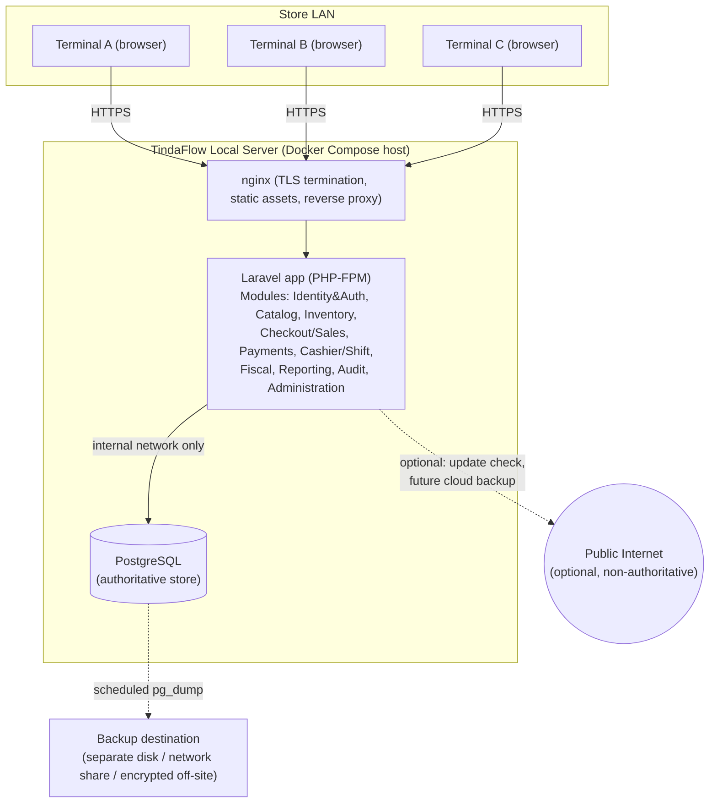

# Architecture — TindaFlow POS

## Status
APPROVED — Stage 3 baseline, remediation pass 2 (2026-09-16), ready for
`stage-3-baseline` tagging. Builds on the Stage 2 domain baseline
(`stage-2-baseline`, now pointing to the pass-3 amendment commit). This
architecture required three touches to Stage 2 across two remediation
passes, all disclosed and none silent: (1) invariant #5's idempotency
scope, rescoped from `(store_id, key)` to `(terminal_id, key)` — an
authorized "apply" item, not a gap; (2)/(3) `void`/`refund` gained
processing-context fields (`terminal_id`/`fiscal_day_id`/`shift_id`) and a
new `refund_settlement` entity — both reported as apparent gaps first,
then applied only after explicit owner approval, as Stage 2 amendment
pass 3. No other Stage 2 domain model, invariant, state machine, or ERD
entity is altered. Every architectural decision that materially
constrains future implementation is recorded as a numbered ADR in
[decisions/](decisions/) and referenced here rather than re-argued.

See also: [deployment.md](deployment.md) (container topology, backup/
restore, observability, network detail), [offline-strategy.md](offline-strategy.md)
(internet-offline vs. server-offline terminology, connectivity-loss
scenarios), [erd.md](erd.md) (amended in Stage 2 pass 3 — no longer
"unchanged from Stage 2," since it *is* Stage 2's own ERD).

---

## Architecture diagram (logical)



No terminal talks directly to PostgreSQL (§16); no arrow into the checkout
path crosses the Internet boundary (ADR-002).

## 1. Application architecture — modular monolith

See **ADR-001** for the full module list, ownership table, and rejected
alternatives. Summary: one Laravel deployable, ten logical modules with
explicit table ownership and a one-directional dependency rule (Checkout/
Sales orchestrates Catalog/Inventory/Cashier-Shift/Fiscal/Payments/Audit;
nothing depends on Reporting; only Audit's own service writes
`audit_event`/`electronic_journal_entry`). No generic repository
abstraction is introduced where Eloquent already suffices; abstractions
exist only where they encode real domain behavior (`CheckoutService`,
the Money/Tax calculator in §11, `InvoicePrinter` in §13).

## 2. Deployment shape

See [deployment.md](deployment.md) for the full topology, and **ADR-002**
for the LAN-first decision and its rationale. Summary: cashier terminals
are browsers on the store LAN talking only to the local TindaFlow server
(nginx → Laravel → PostgreSQL, all on one Docker host). The only things
that may ever touch the public Internet are non-authoritative
conveniences (application-update checks, a future optional cloud-backup
upload) — nothing in the login → barcode lookup → checkout → payment →
invoice → print → inventory → shift → fiscal-journal path requires it.

## 3. Container topology

See [deployment.md](deployment.md) for the concrete Docker Compose
sketch. Summary: three containers — `nginx`, `app` (Laravel/PHP-FPM),
`postgres`. **No Redis, RabbitMQ, Kafka, or Elasticsearch in V1.**
Laravel's queue/cache drivers default to the `database` driver (using
PostgreSQL itself), which is sufficient at V1's scale (a handful of
terminals, no background-job volume that needs a dedicated queue worker
today). **Documented trigger for introducing Redis later:** if a future
phase adds a genuinely latency-sensitive cache (e.g., product/barcode
lookup at a scale where a database-backed cache measurably underperforms)
or a background job volume high enough that database-driver queue polling
becomes a measured bottleneck — not introduced speculatively now.

## 4. Database authority — what enforces what

PostgreSQL is the single authoritative financial data store. No financial
invariant is trusted to frontend or controller validation alone:

| Guarantee | Enforced by |
|---|---|
| Invoice number uniqueness, no reuse | **Database constraint** (`UNIQUE(store_id, invoice_number)` on `invoice`) + **transaction** (ADR-004's row lock ensures the constraint is never even tested against a real race) |
| Idempotency-key uniqueness | **Database constraint** (`UNIQUE(terminal_id, idempotency_key)` on `sale`, `terminal_id` resolved server-side from the enrolled terminal context — never client-supplied) — see ADR-010 |
| One `OPEN` shift per terminal | **Database constraint** (partial unique index `UNIQUE(terminal_id) WHERE status='OPEN'` on `shift`) |
| One `OPEN` shift per cashier | **Database constraint** (partial unique index `UNIQUE(cashier_id) WHERE status='OPEN'` on `shift`) |
| One `OPEN` fiscal day per terminal | **Database constraint** (partial unique index `UNIQUE(terminal_id) WHERE status='OPEN'` on `fiscal_day`) |
| Exactly one Z-Reading per fiscal day | **Database constraint** (`UNIQUE(fiscal_day_id)` on `z_reading`) + **transaction** (generated atomically with the `OPEN→CLOSED` transition) |
| No fiscally-journalable event without exactly one journal entry | **Database constraint** (`UNIQUE(source_type, source_id, event_type)` on `electronic_journal_entry`) + **transaction** (ADR-005) |
| At most one successful void per sale | **Database constraint** (partial unique index `UNIQUE(sale_id) WHERE status='VOIDED'` on `void`) |
| Refund-reference integrity | **Database constraint** (FK `refund_item.sale_item_id → sale_item.id`, `NOT NULL`, no `ON DELETE` — nothing ever deletes a `sale_item`) + **domain service** (cumulative-quantity/monetary cap checks, DISC-004, computed from prior rows, not expressible as a static SQL constraint alone) |
| No update/delete on `sale`, `sale_item`, `payment`, `invoice`, `audit_event`, `electronic_journal_entry`, `stock_movement`, `x_reading`, `z_reading` once written | **Application policy** (no route/controller exposes an update/delete action) **hardened by database-level revocation**: the application's PostgreSQL role has no `UPDATE`/`DELETE` grant on these tables at all (Stage 5), so even a bug in application code cannot violate this — it fails at the database, not just by convention |
| Server-authoritative totals, discount allocation, tax decomposition | **Domain service** (the Money/Tax calculator, §11) — inherently not a static constraint, since it's a computed relationship across many rows within one transaction; verified by **automated tests** (Stage 8) exercising DISC-001–006 |
| Fiscal day closure blocked while any shift is open | **Domain service** query at closure time, executed **inside the closure transaction while holding the fiscal_day row lock** (§8) — a plain `CHECK` constraint cannot express "no related row exists," so this is enforced procedurally, not declaratively, but still inside the same transaction as the state change it gates |

**Principle:** wherever a rule can be expressed as a static database
constraint (uniqueness, foreign key, `CHECK`), it is — this is the
strongest, cheapest-to-verify guarantee available and survives even an
application bug. Rules that depend on the current state of *other* rows
(cumulative caps, cross-table gating) are enforced by a domain service
running inside the same transaction as the change, with the surrounding
lock (§5, §7, §8) making that check race-free. Nothing financial is ever
validated only in a Laravel FormRequest or a React component — those exist
for user experience (fast feedback), not as the authority.

## 5. Checkout transaction boundary

See **ADR-003** for the full step-by-step transaction and its rejected
alternatives. Summary: one `DB::transaction()` in `CheckoutService::finalize()`
covering idempotency check → lock acquisition → re-validation → Money/Tax
calculation → `sale`/`sale_item`/`payment` insert → invoice allocation →
`stock_movement` insert → `audit_event`/`electronic_journal_entry` insert →
commit. Any failure anywhere in that chain rolls back everything; there is
no partially-finalized sale state, ever.

## 6. Idempotency

See **ADR-010** (`decisions/ADR-010-idempotency-design.md`) for the full
design. Summary: client generates a UUIDv4 `Idempotency-Key` per checkout
attempt (not per retry — the *same* key is reused across retries of the
*same* attempt); scope is **`(terminal_id, idempotency_key)`**, with
`terminal_id` resolved server-side from the enrolled terminal context
(ADR-011), never trusted from a request parameter — unique-constrained
**(rescoped from `(store_id, idempotency_key)` during this remediation
pass; see ADR-010's revision note and the corresponding one-line
correction to Stage 2 invariants.md #5)**. Same key + same request-payload
hash → returns the original `sale`/`invoice` result, no new row. Same key
+ *different* request-payload hash → rejected with `409 Conflict` /
`IDEMPOTENCY_KEY_REUSED` (a genuinely different request must use a new
key; silently accepting a payload change under a reused key would let a
client overwrite what "this attempt" means, which is unsafe for a
financial record). A different terminal presenting a coincidentally
identical key is not a near-miss at all under this scope — it lands in a
completely separate namespace.
Concurrent duplicate requests with the same key race on the database
unique constraint: the loser's `INSERT` fails the constraint, and the
loser's request handler catches that specific failure and re-fetches/
returns the winner's result rather than surfacing a generic 500 error —
so two near-simultaneous submits of the same checkout (e.g., a double-
click that a disabled button didn't fully prevent) always converge on one
`sale`, never two. Keys do not "expire" in the sense of being reusable for
a new attempt — a key is permanently associated with whatever attempt
first used it; a client that wants a new attempt generates a new key.

## 7. Invoice sequence concurrency

See **ADR-004** for the full mechanism (`SELECT ... FOR UPDATE` on the
`invoice_series` row, taken first in lock order, inside the checkout
transaction), the rejected alternatives (bare `SEQUENCE`, in-memory
counter, optimistic locking), and the corrected numbering-continuity
analysis below.

**Correction (this revision):** a legitimate void does **not** create an
invoice-number gap. A voided sale's invoice number remains permanently
allocated, present, and accounted for in the sequence — only its `status`
changes to `VOIDED`; the sequence itself stays continuous. The real
exception condition worth naming is an **unexpected/unexplained missing
serial** — a number with no corresponding `invoice` row at all (voided or
completed) — which this architecture's transactional allocation
(allocation and sale-creation as one atomic operation, ADR-003/ADR-004)
should never produce through normal operation. This architecture does not
invent a BIR treatment for that exceptional scenario; its operational/
compliance handling is marked **`BIR-REVIEW-REQUIRED`**
(see [bir-reference-register.md](../01-research/bir-reference-register.md)).

**`invoice_number` and `transaction_number` are unambiguous, separate
namespaces — restated explicitly per RMO 24-2023's requirement that a
system-generated transaction number use a different series from the
accountable invoice/receipt number:**
- **`invoice_number`** (via `invoice_series`, ADR-004) is the accountable,
  BIR-relevant fiscal serial — sequential and permanent once allocated; a
  void changes that number's `status`, never its presence in the
  sequence.
- **`transaction_number`** (on `sale`, Stage 2 domain-model.md §2.7) is
  TindaFlow's own internal, human-readable transaction identifier —
  useful for cashier/support reference and lookup, drawn from a distinct
  namespace/series that has no fiscal significance and no relationship to
  `invoice_series`'s allocation.
These two identifiers are never interchangeable, never derived from one
another, and never share a series — a rule already structurally true in
the frozen Stage 2 schema (they are separate columns with no shared
sequence), stated here explicitly so no future implementation ever
conflates them.

## 8. Fiscal day / Z-Reading architecture

Preserving the frozen Stage 2 semantics (`shift → x_reading`, `fiscal_day →
z_reading`), Stage 3 adds the concurrency mechanics:

- **FiscalDay opening:** implementation-level trigger (whether the first
  shift-open of the day auto-opens the fiscal day, or a separate explicit
  action, was left open by Stage 2 and remains a Stage 5/7 decision — not
  an architecture-level concern beyond noting that whichever path is
  chosen must itself run inside a transaction that checks/enforces "at
  most one `OPEN` fiscal_day per terminal" via the same database
  constraint listed in §4).
- **FiscalDay resolution during checkout:** step 3 of the checkout
  transaction (ADR-003) resolves "the currently open `fiscal_day` for this
  terminal" by querying `fiscal_day WHERE terminal_id = ? AND status =
  'OPEN'` **after** acquiring that row's lock (see lock ordering below) —
  never cached from an earlier point in the request, and never inferred
  from `sold_at`/calendar date (Stage 2 invariant #9).
- **Z-Reading generation / closure transaction — formalized (this
  revision):** one `DB::transaction()`, analogous in shape to checkout
  finalization:

  ```
  BEGIN
    lock FiscalDay                              -- SELECT ... FOR UPDATE
    verify FiscalDay.status = OPEN              -- else ROLLBACK, "already closed"
    verify no Shift referencing this FiscalDay has status = OPEN
                                                 -- Stage 2 invariant #36; else ROLLBACK,
                                                 -- "close all shifts before end-of-day"
    derive totals from authoritative committed records
                                                 -- SUM over Sale/Payment/Void/Refund/CashMovement
                                                 -- for this fiscal_day_id -- NEVER accepted from the browser
    INSERT ZReading (fiscal_day_id, totals_snapshot, generated_at, generated_by, ...)
    INSERT ElectronicJournalEntry (event_type = 'Z_READING', source_type = 'z_reading', source_id = <new z_reading.id>, ...)
    INSERT AuditEvent (event_type = 'Z_READING_GENERATED', ...)
    UPDATE FiscalDay SET status = CLOSED, closed_at = now()
  COMMIT
  ```

  Every value in `ZReading.totals_snapshot` is computed by this
  transaction from already-committed rows — the endpoint that triggers
  closure accepts no totals from the client at all, consistent with §4's
  "server-authoritative totals" principle and Stage 2's "readings are
  reproducible, never authoritative inputs" invariant (#40).
- **Failure behavior:** if the open-shift check fails, the transaction
  rolls back before any write — the fiscal day remains `OPEN`, no
  `z_reading` is created (satisfying Stage 2 invariant #42's "exactly
  one, never zero-then-retry-into-two" by construction: a failed attempt
  never produced a first one).
- **Preventing post-closure attribution (BIR-014):** the checkout
  transaction's `fiscal_day` row lock (above) and the closure
  transaction's `fiscal_day` row lock are **the same lock** — they
  serialize against each other by construction. A checkout that begins
  while the fiscal day is still `OPEN` either (a) commits before closure
  begins (closure then correctly sees this sale in its aggregation), or
  (b) is still waiting for the lock when closure starts, in which case
  closure completes first, flips status to `CLOSED`, and the checkout
  transaction — once it acquires the lock — re-reads `status` and finds
  `CLOSED`, failing the checkout with a clear "fiscal day has closed"
  error rather than silently attributing the sale to a closed day. This
  is what makes RMO 24-2023's "no transactions for that operation date
  after Z-Reading generation" ([BIR-014](../01-research/bir-reference-register.md))
  a database-enforced guarantee, not a UI-level courtesy.
- **Shift/X-Reading closure policy — TindaFlow operational/accountability
  policy (new, this revision):** confirmed directly by Stage 2 invariant
  #36 ("a fiscal day cannot close while it has an open shift") and made
  explicit here as the required operational sequence: finish fiscal
  operations at the terminal → close the `shift` (which generates its
  closing `x_reading`, Stage 2 §2.5) → confirm no `OPEN` shift remains
  referencing that `fiscal_day` → only then may Z-Reading generation
  proceed. **This exact step-by-step sequence (close shift, generate
  X-Reading, then Z-Reading) is TindaFlow's own accountability policy
  layered on top of BIR-014's broader requirement** (Z-Reading must cover
  the whole business day; no post-closure transactions) — RMO 24-2023 does
  not itself mandate this precise procedural ordering as a statutory
  workflow, only the outcome (no open shift left unresolved, full-day
  coverage). Do not present this specific sequencing to a store owner as
  a BIR-mandated procedure; it is TindaFlow's chosen way of satisfying
  BIR-014's actual requirement.
- **Lock ordering:** superseded by the single **Global Lock Order**
  section immediately below, which replaces this operation-specific note
  with one authoritative ordering covering Checkout, Void, Refund, Shift
  Close, and Z-Close together.
- **Reprint behavior:** unaffected by fiscal-day status — an `invoice`
  belonging to a now-`CLOSED` fiscal day remains reprintable indefinitely
  (reprinting reads only the invoice snapshot, per ADR-006, and creates no
  new financial record).
- **Explicitly not decided here:** the cashier-facing UX for opening a
  fiscal day (a button? automatic? a manager-only action?) — Stage 2 and
  this architecture only establish the data/concurrency rules; the UX is
  Stage 7 work.

## 9. Electronic journal

See **ADR-005** for the full mechanism: synchronous, in-process,
same-transaction writes; no message broker; a database uniqueness
constraint as the hard backstop against duplicates/omissions; ordering by
`occurred_at` + `id`; append-only retention with no automated deletion.

## 10. Invoice snapshot versioning

See **ADR-006** for the full `schema_version`-tagged JSONB snapshot design,
the versioned-renderer approach to forward compatibility, and the explicit
rule that relational fields (not the JSON) are the query/reporting surface.

## 11. Tax / Money component

See **ADR-012** for the full decision and rejected alternatives.
**One authoritative component owns Money, Quantity, discount allocation,
tax decomposition, rounding, and refund financial-basis calculation** — a
single PHP service (module: shared/kernel, used by Checkout/Sales and
Payments; conceptually `FinancialCalculator` composed of a `Money` value
object, a `Quantity` value object, a `DiscountAllocator`
(implementing the Deterministic Proportional Allocation algorithm from
Stage 2 §2.7a), and a `TaxCalculator` (sum-then-decompose + per-line
allocation, Stage 2 §3.1). **No other layer reproduces these rules:**

- React computes a **preview only** (for cashier-facing responsiveness —
  showing a running total as items are scanned) using the same rounding
  *display* conventions but is never treated as authoritative; the
  checkout transaction (§5) always recomputes from scratch server-side
  and a client/server total mismatch beyond a documented tolerance is
  rejected outright (Stage 2 invariant #4/#3), never silently accepted.
- Controllers never perform arithmetic on `Money`/`Quantity` values
  directly; they call the `FinancialCalculator` and persist its output.
- Reports (§20) read already-computed, already-persisted relational
  fields (`sale.grand_total`, `sale_item.tax_amount`, etc.) — they do not
  re-run tax/discount logic over raw inputs.
- The Refund workflow calls the same `FinancialCalculator`'s refund-basis
  method (implementing the cumulative-recompute-then-subtract rule,
  Stage 2 §2.9) rather than reimplementing proration.

**Versioning consideration, without overengineering a rules engine:** if a
future tax-rate change occurs (e.g., a VAT rate change), the
`FinancialCalculator`'s rate lookup is a single, centrally-configured
value (or, if a future need arises, an effective-dated `tax_rate`
lookup analogous to `tax_registration`'s effective-dating pattern) — not
duplicated in multiple call sites. V1 does not build a generalized
"pluggable tax rules engine"; it builds one correct, centrally-owned
calculator and revisits its internal structure only if a second tax
regime genuinely needs it (consistent with Stage 2's own "do not
overbuild" instruction on discount allocation).

## 12. Fiscal installation architecture

See **ADR-009** for the accreditation/PTU independent-effective-dating
decision (an additive refinement of Stage 2's `fiscal_installation`
entity, not a change to it) and its explicit non-claim: **this architecture
does not itself constitute BIR accreditation** — it only ensures the data
model can correctly represent a real accreditation and PTU history if and
when one is obtained. `fiscal_installation.deployment_model`
(`STANDALONE`|`SERVER_CONNECTED`) and the `terminal_fiscal_installation`
join table (both frozen at Stage 2) already support both BIR eAccReg
deployment patterns ([BIR-013](../01-research/bir-reference-register.md))
without further architectural change.

## 13. Printing

See **ADR-007**: browser-rendered, print-optimized HTML for 80mm thermal
output, behind an `InvoicePrinter` seam with exactly one V1 implementation;
printing happens strictly after the checkout transaction commits, so a
print failure can never roll back a finalized sale — the only recovery
path is reprint (Stage 2's unchanged reprint rule: no new number, an
`INVOICE_REPRINTED` audit event, a visible reprint mark).

## 14. Barcode scanners

USB barcode scanners are assumed to operate as HID keyboard devices (the
near-universal behavior for retail scanners) — **no server-side scanner
driver or device integration exists or is needed.** Architectural
implication is entirely frontend: the POS cart-input field must (a) retain
keyboard focus by default whenever the cashier screen is active, (b)
distinguish a fast, uninterrupted burst of keystrokes followed by an Enter
(a scan) from manual typing (a search), typically by debounce/timing
heuristics or by relying on the scanner's configured suffix character, and
(c) return focus to that field immediately after handling either a
successful scan or a "product not found" dialog dismissal. This is Stage 7
UI work; no backend architecture is implicated beyond the barcode-lookup
endpoint itself being fast (§21).

## 15. Offline strategy

See [offline-strategy.md](offline-strategy.md) for the full document.
Summary: V1 supports **internet-offline operation** (checkout continues
normally with no public Internet, because the authoritative server is
reachable over the LAN) and explicitly does **not** promise
**server-offline checkout** or full browser-offline transaction sync. If
the local server/PostgreSQL is unreachable, authoritative checkout stops
safely (clear error, no silent local recording) rather than falling back
to a second, unsynchronized ledger. No IndexedDB-based financial ledger
exists in V1; `localStorage`/React state may hold non-authoritative
convenience data (e.g., an in-progress cart before finalization, per Stage
2 §2.11) subject to the security review in §16.

## 16. Network and security

The LAN is **not** treated as inherently trusted:

- **HTTPS/TLS** terminates at `nginx`, even for LAN-only traffic — a
  locally-issued/self-signed certificate (or an internal CA, documented in
  deployment.md) is used rather than plaintext HTTP, since a shared-LAN
  environment (a store's Wi-Fi, potentially shared with customer-facing
  networks if misconfigured) is not assumed safe from packet sniffing.
- **Authentication:** Laravel's standard session-based auth for the
  browser-facing app (not a stateless API token model — V1 has no
  separate mobile/third-party API consumer that would need one).
  Passwords hashed with `bcrypt`/`argon2id` (Laravel default), never
  logged (§19).
- **Session security:** secure, `HttpOnly`, `SameSite=Strict` cookies;
  session timeout on inactivity (configurable; a POS session left open on
  an unattended terminal is a real risk in a retail setting) with a
  distinct, shorter timeout consideration for the POS screen itself versus
  back-office screens (Stage 7 decision).
- **CSRF:** Laravel's built-in CSRF token verification on all state-
  changing requests, standard middleware, no exceptions carved out for
  the checkout endpoint.
- **Rate limiting:** Laravel's rate limiter on authentication endpoints
  (brute-force mitigation) and on the checkout-finalization endpoint
  itself (a defensive cap independent of, and in addition to, idempotency
  — idempotency prevents *duplicate* sales from a retried request;
  rate limiting bounds how fast a compromised/malfunctioning client could
  attempt distinct requests).
- **Secure headers:** standard hardening middleware
  (`X-Content-Type-Options`, `X-Frame-Options`/frame-ancestors CSP,
  `Referrer-Policy`, HSTS once TLS is confirmed working end-to-end).
- **Terminal identity:** see §17 — never trusted as a bare client-supplied
  value.
- **Authorization:** the capability catalog + `can($user, CAPABILITY)`
  pattern from Stage 2 §2.2, enforced server-side on every sensitive
  endpoint (§4's table, Stage 2 invariant #52) — never inferred from
  hidden UI elements.
- **Secret management:** database credentials, `APP_KEY`, and any future
  third-party credentials live in environment variables injected at
  container start (Docker Compose `.env`, not committed to version
  control — `.env` is already `.gitignore`d per the Stage 1 baseline), not
  hardcoded or checked into the repository.
- **Database network exposure:** PostgreSQL's port is **not** published to
  the host's LAN-facing interface at all in the production Compose
  topology — it is reachable only on the internal Docker network from the
  `app` container. Cashier browsers talk exclusively to `nginx`/`app` over
  HTTPS; there is no code path, misconfiguration aside, by which a
  cashier's machine could reach PostgreSQL directly.
- **Container network isolation:** `nginx` and `app` share a network the
  browser-facing traffic uses; `app` and `postgres` share a separate
  internal network; `nginx` has no direct network path to `postgres`
  (defense in depth — even a compromised `nginx` container gains no direct
  database access).
- **Production debug settings:** `APP_DEBUG=false`, Laravel's
  `APP_ENV=production` in the shipped Compose configuration by default;
  verbose error pages and stack traces are never exposed to the browser in
  production (logged server-side only, per §19).

## 17. Terminal identity

See **ADR-011** for the full decision and rejected alternatives.
**A bare `terminal_id` sent by a browser is never trusted.** V1 uses a
**server-issued terminal credential** enrollment model:

1. An `ADMIN` (or `MANAGER` with the appropriate capability) creates a
   `terminal` record in the back office and generates a **one-time
   enrollment token** for it (a random, short-lived, single-use secret).
2. On the target workstation, an administrator opens the TindaFlow
   enrollment page and enters that token once. The server verifies the
   token, issues a long-lived, terminal-scoped credential (stored as a
   secure, `HttpOnly` cookie or a browser-local credential, implementation
   detail for Stage 6), and permanently associates that credential with
   the `terminal` record. The one-time token is invalidated immediately
   after successful use.
3. From then on, every request from that browser carries the
   server-issued terminal credential, and the server resolves
   `terminal_id` **from that credential**, never from a request
   parameter/header the client can set arbitrarily.

**Threat cases addressed:**
- **A cashier impersonating another terminal:** cannot supply an arbitrary
  `terminal_id` — it is derived from the enrollment credential bound to
  *that browser's* enrollment, not from user input. A cashier logging into
  the wrong physical terminal is a login/shift-assignment question (Stage
  7 UX), not a terminal-identity spoofing risk.
- **Copied browser state:** copying the terminal credential to a second
  device would let that second device *also* present as the same
  terminal — this is a real residual risk of any bearer-credential model.
  Mitigation: the credential is `HttpOnly` (inaccessible to JavaScript,
  reducing exfiltration via XSS) and the enrollment flow is an explicit,
  administrator-initiated action (not something a cashier can trigger),
  narrowing the exposure window. Detecting *concurrent* use of the same
  terminal credential from two IPs is a reasonable Stage 6/operational
  enhancement (e.g., an audit alert), not a hard V1 architectural
  requirement, since it does not compromise financial integrity by
  itself (a duplicated terminal identity still funnels through the same
  shift/fiscal-day/invoice-series concurrency controls — it would produce
  a confusing operational picture, not a broken invariant).
- **Lost/replaced workstation:** an administrator revokes the old
  terminal's credential (marks it `DECOMMISSIONED`) and re-enrolls a new
  workstation against either a new or the same `terminal` record,
  generating a fresh one-time token — no PKI, certificate authority, or
  hardware-bound key is introduced, since the threat model here (a small
  number of physically-controlled store terminals) does not justify that
  complexity.

**Not overbuilt:** no client-certificate PKI, no hardware security module,
no device-fingerprinting beyond the credential itself — a server-issued,
`HttpOnly`, administrator-enrolled credential is proportionate to a
handful of terminals inside a single physically-secured store.

## 18. Backup and restore

See **ADR-008** for the full mechanism, retention, encryption, RPO/RTO
targets (proposed, pending owner approval), and the explicit "a Docker
volume is not a backup" requirement. Concrete container/cron
implementation detail is in [deployment.md](deployment.md).

## 19. Observability

Minimal, V1-appropriate, **no Prometheus/Grafana or full enterprise stack**
unless a real operational need later justifies it:

- **Application logs:** Laravel's standard log channel, written to a
  file inside the `app` container's log volume (rotated, not infinitely
  growing), covering unhandled exceptions and significant application
  events (not a substitute for `audit_event`, which is the durable,
  queryable business-event record — application logs are for debugging,
  `audit_event` is for accountability).
- **Security/audit logs:** the `audit_event` table itself (already
  designed, Stage 2) is the primary security/audit trail — no separate
  log-aggregation system is needed for V1 to have this capability, since
  it's already a queryable database table.
- **Container health:** Docker Compose `healthcheck` directives on
  `postgres` (`pg_isready`) and `app` (an HTTP health endpoint returning
  200 only once the database connection and migrations are confirmed
  ready), so `docker compose ps` and any external monitoring can see
  container-level health without a dedicated monitoring stack.
- **Database health:** the same `app` health endpoint includes a
  lightweight `SELECT 1` check; disk-space monitoring (below) also covers
  the database volume specifically, since an out-of-space database is the
  most likely self-hosted failure mode.
- **Disk-space monitoring:** a simple scheduled check (cron or a
  lightweight container) alerting (e.g., writing to the application log
  and/or a configured notification channel) when the host's disk usage
  crosses a threshold (e.g., 80%/90%) — proposed default thresholds
  pending owner approval, not a full metrics pipeline.
- **Backup status:** the backup job (ADR-008) logs its own success/failure
  and duration; a failed backup writes a clearly-flagged log entry (and,
  eventually, a notification) rather than failing silently.
- **What logs must never contain:** passwords (even hashed, never logged
  in cleartext-adjacent debug output), authentication secrets/session
  tokens, full payment card details (V1 doesn't process cards directly,
  but a manually-recorded card reference must not include a full PAN),
  or any other field the security review (§16) flags as sensitive —
  enforced by Laravel's exception-handler redaction configuration and by
  code-review discipline on any explicit `Log::info()` call touching
  request payloads.

## 20. Reporting architecture

Reports query **authoritative relational records only** — never
`invoice_snapshot_json` for core fiscal figures (ADR-006). Indexing/read
patterns needed (Stage 5 migration concern, documented here for
traceability):

| Report family | Primary access pattern | Indexes needed |
|---|---|---|
| Daily sales summary, sales by date range | `sale` filtered by `store_id`, `sold_at` range, `status` | `(store_id, sold_at)`, partial on `status = 'COMPLETED'` |
| Sales by product | `sale_item` joined to `sale`, grouped by `product_id` | `(sale_id)` (FK, already indexed), `sale_item(product_id)` |
| Sales by category | `sale_item` → `product` → `category`, grouped | `product(category_id)` |
| Sales by cashier | `sale` grouped by `cashier_id` | `sale(cashier_id, sold_at)` |
| Sales by payment method | `payment` joined to `sale`, grouped by `method` | `payment(sale_id, method)` |
| VAT/tax breakdown | `sale` aggregate columns (`taxable_sales`, `vat_amount`, etc.), or `sale_item` for per-line detail | `(store_id, sold_at)` as above; no new index if aggregate columns are used directly |
| Void report | `void` filtered by `status`, joined to `sale` | `void(status, requested_at)` |
| Refund report | `refund`/`refund_item` filtered by `status`/date | `refund(status, refunded_at)` |
| Discount report | `sale_item(line_discount_amount, allocated_order_discount_amount)` aggregated, or `sale.discount_total` for a coarser view | covered by existing `sale`/`sale_item` indexes above |
| Inventory on hand / low stock | `stock_balance` filtered by `location_id`, compared to `product.reorder_level` | `stock_balance(location_id, product_id)` (likely the table's natural key) |
| Inventory movement | `stock_movement` filtered by `product_id`/date range | `stock_movement(product_id, occurred_at)` |
| Shift report | `shift` filtered by date/terminal/cashier | `shift(terminal_id, opened_at)`, `shift(cashier_id, opened_at)` |
| Cash variance | `shift.variance` filtered/aggregated by date range | covered by the shift indexes above |

**No data warehouse, no separate analytics database, no ETL pipeline in
V1** — the single PostgreSQL instance, with the indexes above, is expected
to comfortably serve a single store's reporting volume; revisit only if
Stage 8 performance testing (§21) shows otherwise.

## 21. Performance targets (proposed, for owner approval)

These are V1 design targets to inform indexing and Stage 8 test plans —
not contractual guarantees:

| Operation | Target (p95, single store, LAN) |
|---|---|
| Barcode lookup (scan → item added to cart) | ≤ 150 ms server response time |
| Cart update (quantity change, line removal) | ≤ 100 ms |
| Checkout finalization (submit → invoice allocated, response returned) | ≤ 500 ms under normal (1–2 concurrent terminals checking out) load |
| Sales-history search (typical filtered query, e.g. one day's transactions) | ≤ 1 s |
| Simultaneous terminals supported without degradation | at least 4 concurrent terminals actively checking out, for a single-store V1 deployment on modest hardware (the mini-PC/VPS class the brief targets) |

These numbers are proposed defaults; **owner should confirm or adjust**
before they're treated as Stage 8 pass/fail criteria.

## 22. Deployment and update safety

- **Database backup before every migration** — a mandatory, automated
  pre-step in the deployment procedure (ADR-008's mechanism, triggered
  on-demand rather than waiting for the next scheduled run), not an
  optional recommendation.
- **Maintenance mode:** Laravel's built-in maintenance mode (returning a
  clear "temporarily unavailable for update" response) is enabled before
  running migrations and disabled only after the application container
  confirms healthy against the new schema — cashiers see a clear message
  rather than a confusing partial failure mid-upgrade.
- **Migration ordering:** standard Laravel migration sequencing
  (timestamp-ordered, run inside the deployment procedure before the new
  application code starts serving traffic) — no manual, undocumented
  migration steps.
- **Rollback limitations — stated honestly, not glossed over:** Laravel
  migrations can define a `down()` method, but a rollback that would drop
  or truncate a column already holding real financial data is never
  executed automatically; the documented recovery path for a bad
  deployment is **restore the pre-migration backup** (ADR-008), not "run
  migrate:rollback and hope," except for schema changes verified safe to
  reverse (e.g., adding a nullable column can be safely rolled back;
  altering a monetary column's precision cannot be, and is never
  attempted without a backup-verified path).
- **Application-version tracking:** the deployed application version
  (e.g., a git tag or build identifier) is recorded and visible in an
  admin-only diagnostics view, so a support conversation can always
  establish "which version is this store running" without guesswork.
- **Invoice snapshot backward compatibility:** guaranteed by ADR-006's
  `schema_version` design — an application upgrade never needs to
  "migrate" historical `invoice_snapshot_json` payloads; old renderers
  remain in the codebase indefinitely.
- **Fiscal software-version history:** an application upgrade that
  changes anything relevant to `fiscal_installation.software_version`
  (once accreditation is real, per ADR-009) inserts a new accreditation-
  history row rather than overwriting the current one — consistent with
  RMO 24-2023's major-enhancement re-accreditation framing.
- **Never automatic destructive migrations without a documented backup/
  rollback plan** — restated as an explicit, non-negotiable deployment
  procedure rule, not merely a preference.

## 23. Disaster behavior

| Scenario | Financial outcome | Operator behavior | Recovery path |
|---|---|---|---|
| **Internet fails** | None — checkout unaffected (ADR-002) | No action needed | Automatic once Internet returns; nothing to recover |
| **Cashier browser crashes** | None — no `sale` existed yet if mid-cart (Stage 2 §2.11); if the crash occurs after a successful finalize response was already shown, the sale is already committed | Reopen the browser, log in, resume at POS | Cart contents lost if not locally cached; already-finalized sales are unaffected and visible in sales history |
| **Cashier PC loses power** | Same as browser crash — a `sale` only exists once the transaction committed server-side, which happens independent of the client's power state | Restart the PC, log back in | Same as above; if power loss occurred *during* a checkout submission, see the "checkout request times out" row below |
| **Printer fails** | None — printing is strictly post-commit (ADR-007) | Reprint once the printer is fixed, or use a different printer | Reprint (audited, no new invoice number) |
| **LAN fails (but the server itself is up)** | Checkout stops for terminals that lose connectivity to the server; any terminal still connected is unaffected | Terminals show a clear "cannot reach server" state, not a false "processing" spinner | Automatic once LAN connectivity is restored; no data loss, since no local ledger exists to reconcile |
| **Local server stops** (process crash, container stops) | Authoritative checkout is unavailable store-wide until the server restarts | Store cannot process card/POS-recorded sales until restart; a manual/paper fallback is an operational (not software) decision for the store owner | Docker Compose restart policy (`restart: unless-stopped`) brings the container back automatically in most cases; a hardware failure requires the restore procedure (ADR-008) on replacement hardware |
| **PostgreSQL stops** | Same as "local server stops" — `app` cannot function without it | Same as above | Same as above; `app`'s health check (§19) reflects this immediately rather than serving stale/broken responses |
| **Disk becomes full** | Writes fail; PostgreSQL may refuse new transactions | Disk-space monitoring (§19) should have alerted before this point | Free space (e.g., rotate/offload old backups per ADR-008's retention policy — never by deleting transaction data itself), restart affected services |
| **Checkout request times out after server processing** | **Ambiguous to the client, resolved by idempotency** — see below | Client shows a "please wait / retrying" state, not an immediate failure | Client retries with the **same** idempotency key; the server either returns the already-committed result (if the original request actually succeeded) or completes the original attempt now (if it was still in-flight) — never creates a second sale |
| **Duplicate checkout request arrives** (double-click, retry storm) | None — see ADR-010 | Transparent to the cashier; UI still shows one completed sale | N/A — resolved at the database-constraint level, not by operator action |

**The timeout case, expanded:** a client that submits a checkout and then
experiences a network timeout genuinely cannot know, from that timeout
alone, whether the server's transaction committed before or after the
connection dropped. This is precisely why idempotency (§6/ADR-010) is
scoped as a *safe-retry* mechanism rather than a *duplicate-prevention-only*
mechanism: retrying with the same key is always the correct client
behavior on any ambiguous failure (timeout, 5xx, connection reset) — the
server-side unique constraint guarantees that retry either (a) finds the
original attempt already completed and returns that result, or (b) the
original attempt genuinely never started/committed, and this retry becomes
the one attempt that does. There is no third outcome where the client's
retry creates a second, duplicate `sale`.

## Global lock order (finalized — Stage 2 gap resolved, all operations now fully specifiable)

The original draft specified a lock order for Checkout alone (shift →
fiscal_day → invoice_series). Once Void and Refund finalization are
brought into the same discipline (§9/§24 below), an operation-specific
order is no longer sufficient — a single, authoritative order covering
every operation that can take more than one of these locks is required, so
no two operations can ever acquire the same pair of resources in opposite
sequence. **This section previously left Void/Refund's own `shift`/
`fiscal_day` locks unspecified pending a Stage 2 amendment; that amendment
(processing-context fields on `void`/`refund`) is now approved and
applied, so every row below is fully specified.**

**The global order, most-coarse to most-specific:**

```
shift  →  fiscal_day  →  sale  →  sale_item (ascending id/line_number)  →  invoice_series
```

Every operation acquires a **subset** of this list, always in this
relative order (an operation may skip a level it doesn't need, but never
acquires a later-listed resource before an earlier-listed one it also
needs):

| Operation | Locks taken (in order) | Notes |
|---|---|---|
| **Checkout (Sale finalization)** | `shift` (the sale's own, currently-open shift) → `fiscal_day` (the sale's own, currently-open fiscal day) → `invoice_series` | Unchanged from the original design (ADR-003/004); no `sale`/`sale_item` lock needed since the row doesn't exist until this transaction creates it |
| **Void completion** | `shift` (the void's own **processing** shift — Stage 2 `void.shift_id`, resolved from the ADR-011 terminal context) → `fiscal_day` (the void's own processing fiscal day — `void.fiscal_day_id`) → `sale` (the **original** sale, to check/flip `status`) | The `shift`/`fiscal_day` locked here are the *processing* context (Stage 2 invariants #67–#69), never the original sale's own `shift_id`/`fiscal_day_id` — those are read, not locked, since a void never mutates the original sale's fiscal attribution |
| **Refund completion** | `shift` (processing) → `fiscal_day` (processing) → `sale` (original) → `sale_item` (every referenced line, locked in **ascending `id`/`line_number` order** — never in request-payload order, to prevent two refunds touching an overlapping set of lines from deadlocking on each other) | Same processing-context distinction as Void; `sale_item` sits last among Refund's locks per the global order |
| **Shift close** | `shift` (own) | Does not need to lock individual `sale` rows — the race with an in-flight checkout is already resolved by both operations taking the same `shift` lock first |
| **Z-Reading / fiscal day closure** | `fiscal_day` (own) | Does not need to lock individual `shift` rows — the open-shift check is a read verified while holding the `fiscal_day` lock, and each `shift`'s own close operation already serializes against concurrent checkout via the `shift` lock independently |

**Why `sale`/`sale_item` sit between `fiscal_day` and `invoice_series`:**
Checkout never touches an existing `sale` row (it creates one), so this
placement doesn't affect Checkout at all. Void and Refund need `sale`
(and, for Refund, `sale_item`) but never `invoice_series` (§7/ADR-004:
neither allocates a number), so their maximal lock sequence is a
strict prefix-compatible subsequence of the global order regardless of
where `invoice_series` sits relative to `sale`/`sale_item` — it is placed
last simply because it is the single most contended resource per store
(every terminal's checkout touches it) and should be held for the
shortest possible span, which naturally falls at the end of whichever
operation needs it.

**Why Void/Refund lock their *processing* `shift`/`fiscal_day` before the
*original* `sale`:** this follows the global order's coarse-to-fine
sequencing (the same principle that puts `shift` before `fiscal_day` for
Checkout) and is what makes Void/Refund's lock acquisition a genuine
prefix-compatible subsequence of the same global order Checkout,
Shift-Close, and Z-Close all follow — none of the four ever acquires
`sale`/`sale_item` before `shift`/`fiscal_day`, so no cycle is possible
between any pair of these operations. Verified case-by-case in the threat
review immediately below, which previously left the Void/Refund-vs-
Z-Reading and Void/Refund-vs-Shift-Close pairings explicitly unresolved
pending this same Stage 2 amendment — all four pairings are now resolved.

## 24. Architectural threat review

Before treating Stage 3 as complete, each concurrency/failure scenario
below is walked through explicitly — not dismissed with "handled by
transactions":

**Two terminals finalize simultaneously (same store, different invoice
series row? No — same series).** Both transactions attempt `SELECT ...
FOR UPDATE` on the same `invoice_series` row. PostgreSQL grants the lock
to whichever arrives first; the second blocks. The first completes its
full checkout transaction (steps 3–9 of ADR-003) and commits, releasing
the lock. The second then acquires the lock, sees the *post-commit*
`current_number`, and proceeds with the next value. **Resolved by:** the
row lock (ADR-004) plus the fact that the entire multi-step finalize
operation — not just the increment — happens while holding it, which is
exactly why the lock is taken as the *first* step inside the transaction
rather than as a narrow, separate "reserve a number" sub-transaction (a
narrower lock window would let two terminals interleave their `sale`
inserts in a way that's still numerically safe but operationally
confusing to reason about — holding the lock for the whole operation is
simpler to verify correct).

**Same invoice-series contention under high concurrency (more than two
terminals).** Requests queue in arrival order on the row lock; there is no
starvation risk at V1's terminal counts (a handful, not hundreds) and
PostgreSQL's lock queue is FIFO-fair by default for this case. **Resolved
by:** the same mechanism as above, scaled — no additional design needed at
V1's expected concurrency.

**Same idempotency request submitted simultaneously (double-click).** Both
requests attempt to `INSERT` a `sale` row with the same
`(terminal_id, idempotency_key)`. The database's unique constraint allows
exactly one to succeed; the other's `INSERT` raises a unique-violation
error, which `CheckoutService` catches specifically (not a generic
error handler) and responds to by re-querying for the now-existing `sale`
matching that key and returning its result. **Resolved by:** the database
unique constraint (§4) as the actual race-breaker, with application code
providing a graceful response rather than surfacing the constraint
violation as a user-facing error (ADR-010).

**Refund racing another refund (same sale_item).** Both refund-completion
transactions attempt to insert `refund_item` rows against the same
`sale_item`. The cumulative-quantity and cumulative-monetary cap checks
(Stage 2 invariants #27/#28, DISC-004) must read the *current* sum of
prior refunds before inserting — this requires the refund-completion
transaction to lock the relevant `sale_item` row(s) (`SELECT ... FOR
UPDATE`, in **ascending `id`/`line_number` order** per the Global Lock
Order above — relevant when a single refund touches multiple lines)
before computing and checking the cumulative caps, exactly analogous to
the invoice-series pattern. **Resolved by:** extending ADR-004's
row-locking pattern to `sale_item` during refund completion — recorded
here as an explicit Stage 3 requirement (the frozen Stage 2 invariant
states the cap; this architecture specifies the lock that makes checking
it race-free). Without this lock, two concurrent partial refunds could
each independently compute "the cumulative total is currently ₱0, so
₱50 is safe," both succeed, and jointly over-refund the line — the lock
prevents exactly that.

**Void racing refund (same sale).** Stage 2 already establishes these are
mutually exclusive terminal outcomes (invariants #25/#29). The race is
resolved the same way: both the void-completion transaction and the
refund-completion transaction must lock the `sale` row itself
(`SELECT ... FOR UPDATE`) before checking "is this sale already voided /
does an accepted refund already exist," and before writing their own
outcome. Whichever acquires the lock first completes its transition
(`sale.status → VOIDED` or the refund's completion) and commits; the
second, on acquiring the lock, re-checks the now-current `sale.status` and
fails cleanly ("this sale was already voided" / "cannot void a sale with
an accepted refund") rather than proceeding blindly against a stale read.
**Resolved by:** locking `sale` itself as part of both the void- and
refund-completion transactions — another explicit Stage 3 addition to the
frozen Stage 2 rule.

**Z-Reading racing checkout.** Covered in full in §8 above: both lock the
same `fiscal_day` row; whichever acquires it first proceeds, the other
either completes normally before the fiscal day closes or fails cleanly
with "fiscal day has closed" after re-checking status post-lock-acquisition.
**Resolved by:** the shared `fiscal_day` row lock plus the Global Lock
Order above, which prevents this pairing from ever deadlocking against the
`invoice_series` lock.

**Z-Reading racing Refund, and Z-Reading racing Void.** *(resolved —
Stage 2 amendment applied.)* The same principle as "Z-Reading racing
checkout" now applies directly: both operations lock the shared
`fiscal_day` row — the closure transaction locks its own `fiscal_day`;
the Void/Refund completion transaction locks `void.fiscal_day_id`/
`refund.fiscal_day_id` (its own *processing* fiscal day, per the Global
Lock Order above) — before either checks or changes status. Whichever
acquires the lock first proceeds to completion; the loser re-checks
`status` post-lock-acquisition and fails cleanly ("fiscal day has closed
— cannot process this void/refund") if it finds `CLOSED`, exactly
mirroring the Checkout case. *Rows locked:* `fiscal_day` (the processing
day, not the original sale's day — those may differ, e.g. a Friday
refund against a Monday sale locks Friday's `fiscal_day`, never
Monday's). *Constraints:* `UNIQUE(fiscal_day_id)` on `z_reading` (§4).
*Transaction boundary:* the shared `fiscal_day` lock, same as Checkout.
*Result visible to operator:* the losing void/refund attempt shows
"fiscal day has closed" and must be resolved operationally (e.g.,
reprocess under the now-current fiscal day, a Stage 7 UX decision).
*Safe retry/recovery:* the request is not blindly retried — an operator
decides how to proceed, since the underlying business situation (attempting
a correction right at the boundary of end-of-day) genuinely needs a human
decision, not an automatic one. This closes what was, in the prior
remediation report, "the single most important concrete consequence of
the Stage 2 gap" — the forbidden outcome ("Z commits and closes FiscalDay
→ adjustment later commits into that closed FiscalDay") is now prevented
for Void and Refund exactly as it already was for Checkout.

**Shift Close racing Refund, and Shift Close racing Void.** *(resolved —
Stage 2 amendment applied.)* Analogous to "Cashier shift closing while
checkout finalizes": both the shift-close transaction and the Void/Refund
completion transaction lock the relevant `shift` row — shift-close locks
its own row; Void/Refund lock `void.shift_id`/`refund.shift_id` (their own
processing shift, per the Global Lock Order). *Rows locked:* `shift`
(processing). *Constraints:* none beyond the lock itself — this is a
status race, not a uniqueness concern. *Result visible to operator:* the
losing void/refund attempt shows "shift has closed — cannot attribute this
correction," analogous to Checkout's equivalent failure message. *Safe
retry/recovery:* the operator opens a new shift (or resumes an existing
open one) and resubmits — same operational pattern as any other
shift-closed rejection.

**Two simultaneous partial Refunds against overlapping SaleItems.** *(new
— remediation pass; **resolved today**, independent of the Stage 2 gap.)*
Both refund-completion transactions lock `sale` then every referenced
`sale_item` in **ascending `id`/`line_number` order** (the Global Lock
Order above) — never in whatever order the request payload happens to list
them, which is what prevents two refunds touching overlapping but
differently-ordered line sets from deadlocking on each other. *Rows
locked:* `sale`, then each affected `sale_item` (ascending). *Constraints:*
the cumulative quantity/monetary caps (invariants #27/#28, DISC-004),
re-verified under the lock. *Transaction boundary:* one refund-completion
transaction per refund event. *Idempotency:* see the duplicate-submission
case below — this specific race (two *distinct*, legitimate partial
refunds arriving concurrently) is a normal, expected scenario, not a
duplicate. *Result visible to operator:* whichever transaction acquires
the lock second sees the already-updated cumulative total and is rejected
with a clear "exceeds refundable amount" error if its request would now
overshoot the cap — it is never silently truncated or partially applied.
*Safe retry/recovery:* the operator adjusts the requested quantity/amount
and resubmits; no double-refund is possible because the cap check and the
lock are the same mechanism.

**Refund vs. Void** — see "Void racing refund" above; unchanged, already
resolved via the shared `sale` lock.

**Duplicate Void submission.** *(new — remediation pass; **resolved
today**, no change needed.)* Void's own Stage 2 constraint —
`UNIQUE(sale_id) WHERE status = 'VOIDED'` — **is itself a complete
idempotency mechanism** for Void specifically: a second, duplicate void
attempt against the same sale (double-click, retry) simply fails the
unique check once the first commits, with no separate idempotency key
needed. *Rows locked:* `sale`. *Constraint:* the partial unique index
above. *Result visible to operator:* the duplicate attempt shows "already
voided" (by whom, when — from the first attempt's audit trail). *Safe
retry:* not needed; the operation is naturally idempotent by construction.

**Duplicate Refund submission.** *(new — remediation pass; **partially
resolved, one recommendation added**.)* Unlike Void, Refund has no
constraint that makes a distinct-but-under-cap duplicate submission
impossible: the cumulative-cap check (above) prevents *over*-refunding
past `net_line_amount`, but two accidental, legitimate-looking partial
refund submissions (e.g., a double-click producing two separate ₱25
refunds instead of one) can both succeed if their combined total still
fits under the cap — an operationally wrong outcome the cap alone does not
catch. **Recommendation (new in this pass):** extend ADR-010's
already-generalized idempotency-record shape
(`operation_type`/`result_resource_id`) to Refund finalization requests —
`operation_type = 'REFUND'`, `result_resource_id → refund.id`, same
`(terminal_id, idempotency_key)` scope. This is a natural extension of a
mechanism Stage 3 already designed generally, not a new mechanism; it does
not depend on the Stage 2 processing-context gap and can be adopted at
Stage 5 independent of that gap's resolution.

**Refund commit succeeds but client times out.** *(new — remediation
pass.)* With the Refund-idempotency-key extension just recommended, this
resolves identically to Checkout's timeout case (§23): the client safely
retries with the same key and receives the original committed result.
**Until that extension is implemented**, the safe recovery is operational,
not architectural: the operator checks the sale's refund history (Module
J, Sales History) before resubmitting rather than assuming the request was
lost.

**Refund commit succeeds but printer fails.** *(new — remediation pass.)*
If a printable refund document (e.g., a refund receipt) is ever
introduced, it follows the identical principle already established for
invoices (§13/ADR-007): printing happens strictly after the refund
transaction commits, so a print failure has no path back to the
already-committed `refund`/`refund_item` rows; recovery is reprint. Stage
2 does not currently define a dedicated audit-event type for a refund-
document reprint (only `INVOICE_REPRINTED` exists) — noted here as a small
Stage 5/7 addition if a printable refund document is ever built, not a
blocking gap today, since V1 has no such document specified yet.

**Cashier shift closing while checkout finalizes (same shift).** The
shift-closing transaction and the checkout transaction both need the
`shift` row: closing needs to compute final totals and flip status;
checkout needs to verify the shift is `OPEN` and attribute the sale to it.
Per the fixed lock order, `shift` is acquired **first** by both
operations. Whichever transaction acquires it first proceeds to
completion (commit) before the other's lock request is granted. If
checkout wins: it attributes the sale to the still-open shift and
commits; the shift-close transaction then correctly includes that sale in
its totals. If shift-close wins: it flips `shift.status` to `CLOSED` and
commits; checkout then acquires the lock, re-checks `shift.status`, finds
`CLOSED`, and fails cleanly ("shift has closed — cannot attribute this
sale") rather than attributing a sale to a closed shift. **Resolved by:**
locking `shift` as the first lock in both operations, and re-checking
status after acquiring the lock rather than trusting a pre-lock read —
the same pattern used throughout this section.

**Stock adjustment racing sale (same product/location).** A manual stock
adjustment and a concurrent sale's `SALE`-type stock movement both insert
into the append-only `stock_movement` table — these do **not** need to
lock against each other, because `stock_movement` is insert-only (Stage 2
invariant #45: never updated or deleted) and `stock_balance` is a derived
projection, not a value either operation reads-then-writes
transactionally in a way that could race destructively. If `stock_balance`
is maintained as a trigger-updated or application-updated running total
(Stage 5 decision), that update is a single atomic
`UPDATE ... SET quantity_on_hand = quantity_on_hand + :delta` — an
atomic increment, not a read-modify-write from application code — which
PostgreSQL serializes correctly under MVCC without an explicit
application-level lock. **Resolved by:** append-only movement inserts plus
an atomic (not read-then-write) balance update; no explicit row lock
needed here because the operation is naturally commutative and atomic at
the SQL level.

**Server restart during checkout.** If the server process (or its
database connection) dies mid-transaction, PostgreSQL's own crash
recovery guarantees the in-flight transaction was either fully committed
(durable, per its WAL) or entirely rolled back — there is no in-between
state a restart can expose. The client experiences this as the "checkout
request times out" scenario from §23, resolved by the same idempotent
retry. **Resolved by:** PostgreSQL's ACID durability guarantees (no
custom recovery logic needed) plus idempotent client retry.

**Printer failure after checkout commit.** Already addressed structurally
in §13/ADR-007: printing is strictly post-commit, so this scenario has no
financial-integrity dimension at all — it's purely an operational/UX
concern (reprint), not a race or invariant risk.

## 25. Architecture decision table

| Decision | Chosen approach | Alternatives considered | Reason | Trade-off | Stage affected | ADR |
|---|---|---|---|---|---|---|
| Application architecture | Modular monolith, one Laravel app | Microservices; undifferentiated monolith; generic repository layer everywhere | Brief mandates no microservices; Stage 2 invariants need one ACID transaction | Module boundaries are convention-enforced, not compiler-enforced | 3, 4, 6 | ADR-001 |
| Deployment topology | LAN-first, server on-premise/VPS, terminals are browsers | Cloud SaaS; hybrid local-cache-with-cloud-authority | Brief requires internet-independent checkout; avoids Odoo-style offline data-loss risk | Store owner owns backup/hardware reliability | 3, 9 | ADR-002 |
| Checkout transaction boundary | One `DB::transaction()` covering the full finalize operation | Two-phase provisional-then-finalize; saga/compensating transactions; async audit/journal | Single database makes native ACID strictly simpler and stronger | Row locks held for the full operation's duration | 3, 5, 6, 8 | ADR-003 |
| Idempotency | Client UUID key, `UNIQUE(terminal_id, key)`, same-key-same-hash-returns-original | Server-generated keys only; no idempotency (rely on UI disabling); `(store_id, key)` scope (superseded) | Brief explicitly requires this; UI-only protection is not authoritative; terminal scope closes a cross-terminal collision gap `(store_id, key)` left open | Client must correctly persist/reuse the key across retries | 2 (invariants.md #5, corrected), 3, 6, 8 | ADR-010 |
| Invoice numbering concurrency | `SELECT ... FOR UPDATE` on `invoice_series` row | Native `SEQUENCE`; in-memory counter; optimistic locking/version column | Sequences aren't transactional (would burn numbers on rollback); in-memory counters don't work across processes | All terminals serialize on one row per store during checkout | 3, 5, 6, 8 | ADR-004 |
| Electronic journal writes | Synchronous, in-process, same transaction, unique-constrained | Message broker; outbox pattern; DB trigger-based | Brief forbids a broker for V1; journal must never be eventually consistent with its source event | Journal writes add to the critical-path transaction time (small) | 3, 5, 6, 8 | ADR-005 |
| Invoice snapshot | Versioned JSONB (`schema_version`) + flat query columns | Unversioned JSON; regenerate from current config on print; JSON as reporting source | A reprint must never reflect today's configuration; reports need indexable columns | Some data intentionally duplicated (relational + JSON) | 3, 5, 6, 7 | ADR-006 |
| Printing | Browser HTML behind an `InvoicePrinter` seam | ESC/POS now; block commit on print success; server-rendered PDF | Brief defers vendor drivers; printing must never roll back a finalized sale | Less fine hardware control than native ESC/POS | 3, 6, 7 | ADR-007 |
| Backup/restore | Scheduled `pg_dump`, independent storage, encrypted, tested restore | Docker volume alone; continuous WAL replication; CSV export as backup | Brief requires recoverable data; a volume on the same disk isn't independent | Off-site rotation requires operator action | 3, 9 | ADR-008 |
| Fiscal installation | `fiscal_installation` store-scoped; accreditation/PTU independently effective-dated | Single shared effective-dating pair; two unrelated top-level entities; defer to Phase 3 | BIR-012 confirms independent lifecycles; cheaper to model now while empty | Slightly more schema complexity for currently-unused fields | 3, 5 (Phase 3 later) | ADR-009 |
| Money/Tax authority | One `FinancialCalculator` component, backend-only authoritative | Duplicate calculation in React/controllers/reports; shared PHP/TS library; generic tax-rules engine | Prevents drift between preview and authoritative figures | React preview must be kept loosely in sync for UX (not correctness) | 3, 6, 7, 8 | ADR-012 |
| Terminal identity | Server-issued credential via one-time enrollment token | Trust client-supplied `terminal_id`; full client-cert PKI; device fingerprinting; IP-based identification | Client-supplied IDs are spoofable; PKI is disproportionate for a handful of store terminals | Copied browser state remains a residual (bounded) risk | 3, 5, 6, 7 | ADR-011 |
| Global lock order | One order for all operations: `shift → fiscal_day → sale → sale_item (asc.) → invoice_series`; each operation takes a prefix-compatible subset | Operation-specific ad hoc orders (the original Stage 3 draft's approach) | An ad hoc, per-operation order cannot guarantee no two operations acquire a shared pair of resources in contradictory sequence once Void/Refund also take locks | None remaining — Void/Refund's `shift`/`fiscal_day` locks are fully specified now that the Stage 2 processing-context fields exist | 2 (invariants.md #67–#69), 3, 5 | (§ "Global lock order," above §24) |
| Void/Refund processing context & settlement | New `terminal_id`/`fiscal_day_id`/`shift_id` on `void`/`refund`; new `refund_settlement` entity | Leave processing context unmodeled; duplicate `terminal_id`/`shift_id`/`processed_by` onto `refund_settlement` | Stage 3 concurrency design (Z-Reading/Shift-Close locking) and `shift.refunds_total`'s computability both required these fields; `refund_settlement` inherits context from its parent to avoid redundant columns | None identified — purely additive to Stage 2 | 2 (domain-model.md §2.8/§2.9, invariants.md #67–#72, erd.md), 3, 5 | (Stage 2 amendment pass 3; see gap report) |

## 26. Stage 3 exit criteria

**Status: MET.** The two items previously blocked pending a Stage 2 gap
resolution are now resolved — the owner approved the proposed Stage 2
amendment (Void/Refund processing context, `refund_settlement`), it has
been applied, and the previously-blocked lock-order/threat-matrix entries
have been completed accordingly. This section is retained with its
history intact (rather than silently rewritten to look like it was always
complete) so the record of what was blocked, why, and how it resolved
remains visible.

- [x] Deployment topology is explicit — [deployment.md](deployment.md), §2/§3 above.
- [x] Module boundaries are explicit — §1, ADR-001.
- [x] Database authority is explicit — §4.
- [x] Checkout transaction boundary is explicit — §5, ADR-003.
- [x] Idempotency is explicit — §6, ADR-010 (rescoped to `(terminal_id, key)` this pass; Refund-idempotency extension recommended in §24 but not yet mandatory).
- [x] Invoice allocation concurrency is explicit — §7, ADR-004 (corrected this pass: void does not create a gap; the real exception is an unexplained missing serial, marked `BIR-REVIEW-REQUIRED`).
- [x] **FiscalDay/ZReading concurrency is explicit for Checkout, Void, and Refund.** Sale-vs-Z-Reading was resolved from the start (§8). Refund-vs-Z-Reading, Void-vs-Z-Reading, Refund-vs-Shift-Close, and Void-vs-Shift-Close are now resolved too, following the Stage 2 amendment — see the Global Lock Order section (fully specified, no remaining forward-commitment brackets) and §24's threat entries (updated from BLOCKED to resolved).
- [x] XReading responsibility is explicit — §8 (generated at shift close and on demand, per Stage 2; no new architectural mechanism beyond the same transactional-write pattern as ADR-005).
- [x] Journal consistency is explicit — §9, ADR-005.
- [x] Invoice snapshot versioning is explicit — §10, ADR-006.
- [x] Terminal identity is explicit — §17, ADR-011.
- [x] Offline semantics are explicit — §15, [offline-strategy.md](offline-strategy.md).
- [x] Backup/restore is explicit — §18, ADR-008.
- [x] Printing failure semantics are explicit — §13, ADR-007.
- [x] Accreditation/PTU lifecycle separation is explicit — §12, ADR-009.
- [x] Disaster scenarios are addressed — §23.
- [x] **No Stage 2 concept was changed or added *silently*.** One Stage 2 invariant (#5, idempotency scope) was deliberately changed during remediation pass 1, from `(store_id, idempotency_key)` to `(terminal_id, idempotency_key)` — disclosed explicitly in ADR-010's revision note, not silent, and applied because it was an "apply" instruction rather than a "verify and stop" one. Two further apparent gaps (Void/Refund processing-context attribution; Refund settlement) were reported without editing anything, per instruction, and were **not** applied until the owner explicitly approved them — at which point they were added as Stage 2 amendment pass 3, additive only (no existing entity shape, invariant meaning, or state transition altered — see domain-model.md's Pass 3 consistency-validation note). Every Stage 2 touch across all three amendment passes is disclosed in this document, in the ADRs, and in the domain documents' own revision histories — none was made without either being a direct "apply" instruction or explicit prior approval.
