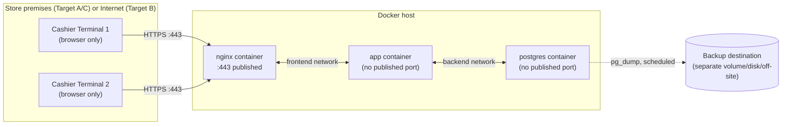

# Deployment — TindaFlow POS

## Status
DRAFT — Stage 3. Concrete deployment detail supporting
[architecture.md](architecture.md) §2, §3, §16, §18, §19, §22. No
implementation (actual Dockerfiles/Compose YAML) is created yet — Stage 9
("Create Docker production deployment") does that; this document specifies
what Stage 9 must build.

---

## 1. Target environments

Per the governing brief, three deployment targets share this same
topology, differing only in where the "TindaFlow Local Server" box
physically lives:

| Target | Server location | LAN | Notes |
|---|---|---|---|
| **A — On-premise mini-PC** | A dedicated small PC inside the store | Store's own Wi-Fi/Ethernet | The reference V1 deployment; matches the brief's primary scenario |
| **B — VPS** | A rented virtual private server, reachable over the internet | Terminals reach it via the internet (effectively their "LAN" is a VPN or the public internet itself) | Same container topology; TLS and network exposure (§16) matter even more here since the network is not physically contained |
| **C — Store LAN server, multiple terminals** | A more capable on-premise server serving several terminals | Store's own LAN | Same as A, sized for more concurrent terminals |

All three run the identical Docker Compose stack described below — the
difference is purely where it's hosted and how terminals reach it, not
what it contains.

## 2. Container topology

```
docker-compose.yml
├── nginx        (reverse proxy, TLS termination, serves compiled React assets)
├── app          (PHP-FPM running Laravel; hosts the modular monolith)
└── postgres     (PostgreSQL — authoritative data store)
```

**No other containers in V1.** Specifically excluded, per architecture.md
§3, unless a documented trigger condition is later met:

- **Redis** — not needed; Laravel's `database` cache/queue driver suffices
  at V1's scale. *Trigger to introduce:* a measured cache-latency or
  queue-throughput bottleneck under real load, not a precautionary
  addition.
- **RabbitMQ/Kafka** — not needed; nothing in V1's architecture requires
  asynchronous cross-process messaging (ADR-005 explicitly keeps the
  fiscal journal synchronous and in-process). *Trigger to introduce:* a
  future feature that genuinely needs durable async job processing at a
  volume the `database` queue driver can't handle.
- **Elasticsearch** — not needed; V1's search needs (product/SKU/barcode
  lookup, sales-history filtering) are served by PostgreSQL indexes
  (architecture.md §20). *Trigger to introduce:* a full-text search
  requirement PostgreSQL's own `tsvector`/`pg_trgm` capabilities can't
  reasonably serve — not anticipated for V1's catalog size.

### Compose sketch (illustrative — Stage 9 finalizes exact syntax/versions)

```yaml
services:
  nginx:
    image: nginx:stable
    ports:
      - "443:443"       # TLS only; no plaintext 80 in production beyond an HTTP->HTTPS redirect
    volumes:
      - ./docker/nginx/conf.d:/etc/nginx/conf.d:ro
      - ./docker/certs:/etc/nginx/certs:ro
      - app-public:/var/www/html/public:ro
    depends_on:
      app:
        condition: service_healthy
    networks:
      - frontend

  app:
    build: ./docker/app
    environment:
      APP_ENV: production
      APP_DEBUG: "false"
      # DB_*, APP_KEY, etc. injected via .env — never committed
    volumes:
      - app-storage:/var/www/html/storage
      - app-public:/var/www/html/public
    healthcheck:
      test: ["CMD", "curl", "-f", "http://localhost/health"]
      interval: 30s
      timeout: 5s
      retries: 5
    depends_on:
      postgres:
        condition: service_healthy
    networks:
      - frontend   # reachable by nginx
      - backend    # reachable by postgres
    restart: unless-stopped

  postgres:
    image: postgres:16
    environment:
      POSTGRES_DB: tindaflow
      # POSTGRES_USER / POSTGRES_PASSWORD injected via .env
    volumes:
      - pgdata:/var/lib/postgresql/data
    healthcheck:
      test: ["CMD-SHELL", "pg_isready -U $$POSTGRES_USER -d $$POSTGRES_DB"]
      interval: 10s
      timeout: 5s
      retries: 5
    networks:
      - backend    # NOT on the frontend network — never reachable from nginx or the LAN
    restart: unless-stopped
    # no "ports:" mapping — not published to the host at all in production

networks:
  frontend:
  backend:

volumes:
  pgdata:
  app-storage:
  app-public:
```

Key properties this sketch encodes (architecture.md §16):
- `postgres` has **no `ports:` mapping** — unreachable from the host's LAN
  interface entirely, only from `app` over the internal `backend` network.
- `nginx` and `postgres` share **no** network — even a compromised `nginx`
  container has no path to the database.
- `app`'s health check gates `nginx` startup ordering (`depends_on:
  condition: service_healthy`) so the reverse proxy never routes traffic
  to an application that isn't actually ready (migrations pending,
  database unreachable).
- `restart: unless-stopped` gives automatic recovery from a container
  crash without manual intervention (architecture.md §23's "local server
  stops" scenario).

## 3. Network diagram (physical/deployment view)



Only port 443 is exposed to the LAN/internet; every other container-to-
container path is internal-only.

## 4. TLS certificates

For Target A/C (on-premise, LAN-only), a certificate is issued by a small
internal CA (a self-signed root generated once at setup, distributed to
store devices' trust stores by the installer) rather than a public CA,
since the server has no public DNS name a public CA could validate against.
For Target B (VPS with a real domain), a standard public certificate
(e.g., via Let's Encrypt/ACME) is used instead. Either way, **plaintext
HTTP is never used for the application itself** — `nginx` redirects any
stray port-80 request to HTTPS and serves nothing else on it.

## 5. Backup and restore — concrete implementation

Implements ADR-008. Realized as a fourth, minimal container (or a host
cron job calling into the `postgres` container — Stage 9 picks whichever
fits the target environment better) running:

```
pg_dump -Fc -h postgres -U <app_role> tindaflow > /backups/tindaflow-$(date +%Y%m%d-%H%M%S).dump
```

on a daily schedule, writing to a `/backups` mount that is **not** the
same Docker volume as `pgdata` — it is bind-mounted to a physically
separate disk/partition on Target A/C, or to a separate cloud volume/
object-storage target on Target B. The dump is then encrypted (e.g.,
piped through `gpg --symmetric` with a key held by the store owner, not
stored alongside the backup itself) before being rotated to any off-machine
destination (USB drive swap, network share, or object storage upload,
depending on what the store has available).

**Retention (proposed, per ADR-008, pending owner approval):** 30 daily +
12 monthly archives, pruned by the same scheduled job — pruning removes old
*backup copies*, never touches the live `sale`/`audit_event`/etc. tables,
which are never automatically deleted regardless of age.

**Restore runbook (finalized during Stage 9, drilled at least once
before go-live):**

1. `docker compose stop app nginx` (stop serving traffic).
2. Spin up a scratch `postgres` container against a fresh volume.
3. `pg_restore -d tindaflow /backups/tindaflow-<timestamp>.dump`.
4. Run `php artisan migrate --force` if the backup predates the currently-
   deployed schema version (see architecture.md §22's compatibility note).
5. Verify: row counts on `sale`/`invoice`/`audit_event` match a recorded
   pre-restore expectation; spot-check a known recent invoice's
   `invoice_snapshot_json` renders correctly (exercises ADR-006's
   versioned-renderer path as part of the verification, not just raw
   data presence).
6. Point the live `postgres` volume at the restored data (or swap the
   volume reference), `docker compose up`.
7. Record the restore in the operations log (what was restored, why, when,
   verification result).

## 6. Deployment/update procedure

Implements architecture.md §22:

1. `pg_dump` a fresh, on-demand backup (independent of the daily schedule)
   before touching anything.
2. Enable Laravel maintenance mode (`php artisan down` with a clear
   customer/cashier-facing message).
3. Pull/build the new `app` image.
4. Run `php artisan migrate --force` against the (already backed-up)
   database.
5. Start the new `app` container; wait for its health check to pass.
6. Disable maintenance mode (`php artisan up`).
7. Record the deployed version identifier (git tag/build ID) in the
   admin-visible diagnostics view (architecture.md §22).

If step 4 or 5 fails, the documented recovery path is: restore the step-1
backup, redeploy the previous known-good `app` image — never a live
`migrate:rollback` against a schema change already holding real financial
data (architecture.md §22's explicit rollback-limitations statement).

## 7. Observability — concrete implementation

Implements architecture.md §19:

- **Application logs:** Laravel's `daily` log channel (rotated, e.g.
  14-day retention for the log files themselves — distinct from, and much
  shorter than, the `audit_event` table's indefinite retention), written
  to the `app-storage` volume.
- **Health endpoint:** `GET /health` on `app`, returning `200` only when
  the database connection succeeds and no pending migrations are detected;
  used by both the Compose `healthcheck` and any external uptime check
  the store owner or a VPS provider's own monitoring might add.
- **Disk-space check:** a small scheduled script (same cron mechanism as
  backups) checking `df` on the host and on the `pgdata`/`backups` mounts
  specifically, logging a warning at a proposed 80% threshold and a
  critical alert at 90% (pending owner approval of these thresholds).
- **Backup status:** the backup job logs its own start/success/failure/
  duration to the same application log channel, with a distinct,
  greppable prefix (e.g., `[BACKUP]`) so a failed backup is trivially
  discoverable without a dedicated monitoring stack.

## 8. What this document deliberately does not decide

- The exact Dockerfile contents for the `app` image (PHP version pin,
  extensions, build steps) — Stage 6/9 implementation detail.
- The exact `nginx` configuration file contents — Stage 9.
- Whether the backup/monitoring scripts run as a fourth container or host
  cron — Stage 9, environment-dependent (a VPS may prefer host cron; an
  appliance-style mini-PC image may prefer a container for consistency).
- The specific off-site backup destination a given store uses (USB
  rotation vs. network share vs. cloud upload) — an operational choice the
  store owner makes at Stage 9 setup time, not a fixed architectural
  requirement.
