# Entity-Relationship Diagram — TindaFlow POS

## Status
APPROVED — Stage 2 baseline (`stage-2-baseline`, tag to be moved to the
pass-3 commit), amended 2026-09-16 for a third time. Pass 1 reflected the
Fiscal Day/Shift split, X-Reading/Z-Reading entities, the revised Fiscal
Installation cardinality, removal of the persisted `DRAFT` sale status,
the expanded Invoice snapshot, and the four-value Refund disposition.
Pass 2 expanded `SALE_ITEM` with the deterministic discount/tax allocation
fields (`line_number`, `gross_line_amount`, `line_discount_amount`,
`order_discount_eligible`, `allocated_order_discount_amount`,
`net_line_amount`, `taxable_base`, `tax_amount`) and added
`sale.order_level_discount_amount`. **Pass 3 (this update) adds
processing-context fields (`terminal_id`/`fiscal_day_id`/`shift_id`) to
`VOID` and `REFUND`, and a new `REFUND_SETTLEMENT` entity** — approved
following a Stage 3 remediation gap report (see
[domain-model.md §2.8/§2.9](../02-domain/domain-model.md) and
[invariants.md](../02-domain/invariants.md) #67–#72). Still lives in
`03-architecture/` per the documentation structure even though it's a
Stage 2 deliverable — see
[domain-model.md](../02-domain/domain-model.md) for prose,
[invariants.md](../02-domain/invariants.md) for the rules these
relationships must uphold, and
[state-machines.md](../02-domain/state-machines.md) for lifecycles.

```mermaid
erDiagram
    STORE ||--o{ TERMINAL : has
    STORE ||--|| STORE_SETTINGS : has
    STORE ||--o{ TAX_REGISTRATION : "has history of"
    STORE ||--o{ USER : employs
    STORE ||--o{ CATEGORY : defines
    STORE ||--o{ BRAND : defines
    STORE ||--o{ PRODUCT : catalogs
    STORE ||--o{ INVENTORY_LOCATION : has
    STORE ||--o{ INVOICE_SERIES : has
    STORE ||--o{ FISCAL_INSTALLATION : owns

    TERMINAL ||--o{ TERMINAL_FISCAL_INSTALLATION : "uses (history)"
    FISCAL_INSTALLATION ||--o{ TERMINAL_FISCAL_INSTALLATION : "used by"
    FISCAL_INSTALLATION ||--o{ INVOICE_SERIES : "issues numbers via (Stage 6B amendment, 2026-09-17)"

    TERMINAL ||--o{ FISCAL_DAY : "operates across"
    TERMINAL ||--o{ SHIFT : hosts
    TERMINAL ||--o{ SALE : records
    TERMINAL ||--o{ STOCK_MOVEMENT : triggers

    FISCAL_DAY ||--o| Z_READING : "closes with"
    FISCAL_DAY ||--o{ SHIFT : contains
    FISCAL_DAY ||--o{ SALE : scopes

    SHIFT ||--o{ X_READING : "generates (0..N)"
    SHIFT ||--o{ CASH_MOVEMENT : logs
    SHIFT ||--o{ SALE : contains

    USER ||--o{ SHIFT : works
    USER ||--o{ SALE : cashiers

    PRODUCT ||--o{ PRODUCT_BARCODE : "has alternate"
    PRODUCT ||--o{ SALE_ITEM : "sold as (reference only)"
    PRODUCT ||--o{ STOCK_MOVEMENT : "moves as"
    PRODUCT ||--o{ STOCK_BALANCE : "balances as"
    CATEGORY ||--o{ PRODUCT : groups
    BRAND ||--o{ PRODUCT : groups

    INVENTORY_LOCATION ||--o{ STOCK_MOVEMENT : "location of"
    INVENTORY_LOCATION ||--o{ STOCK_BALANCE : "location of"

    INVOICE_SERIES ||--o{ INVOICE : allocates

    SALE ||--o{ SALE_ITEM : contains
    SALE ||--o{ PAYMENT : "paid via"
    SALE ||--|| INVOICE : "documented by"
    SALE ||--o{ VOID : "may have attempts"
    SALE ||--o{ REFUND : "may have"

    SALE_ITEM ||--o{ REFUND_ITEM : "returned via"

    REFUND ||--o{ REFUND_ITEM : contains
    REFUND ||--o{ REFUND_SETTLEMENT : "settled via"

    TERMINAL ||--o{ VOID : "processes (own context, distinct from original sale's terminal)"
    FISCAL_DAY ||--o{ VOID : "processed within"
    SHIFT ||--o{ VOID : "processed within"
    TERMINAL ||--o{ REFUND : "processes (own context, distinct from original sale's terminal)"
    FISCAL_DAY ||--o{ REFUND : "processed within"
    SHIFT ||--o{ REFUND : "processed within"

    FISCAL_INSTALLATION ||--o{ INVOICE : "in effect at issuance of"

    STORE ||--o{ AUDIT_EVENT : scopes
    STORE ||--o{ ELECTRONIC_JOURNAL_ENTRY : scopes

    STORE {
        uuid id PK
        string name
    }
    STORE_SETTINGS {
        uuid store_id FK
        string business_name
        string registered_name
        string tin
        string branch_code
        text invoice_header
        text invoice_footer
    }
    TAX_REGISTRATION {
        uuid id PK
        uuid store_id FK
        enum registration_type "VAT | NON_VAT"
        date effective_from
        date effective_to "nullable = current"
    }
    TERMINAL {
        uuid id PK
        uuid store_id FK
        string terminal_code
        enum status "ACTIVE | INACTIVE | DECOMMISSIONED"
        timestamp activated_at
    }
    FISCAL_INSTALLATION {
        uuid id PK
        uuid store_id FK "store-scoped, NOT terminal-scoped"
        enum deployment_model "STANDALONE | SERVER_CONNECTED"
        string machine_serial_number "nullable"
        string software_version
        string min "nullable, Machine Identification Number"
        string ptu_number "nullable"
        date ptu_date "nullable"
        string accreditation_number "nullable"
        date accreditation_date "nullable"
        timestamp installed_at
        timestamp superseded_at "nullable = current"
    }
    TERMINAL_FISCAL_INSTALLATION {
        uuid id PK
        uuid terminal_id FK
        uuid fiscal_installation_id FK
        timestamp effective_from
        timestamp effective_to "nullable = current"
    }
    FISCAL_DAY {
        uuid id PK
        uuid store_id FK
        uuid terminal_id FK
        date business_date "label only, not a query filter for attribution"
        timestamp opened_at
        timestamp closed_at "nullable"
        enum status "OPEN | CLOSED"
    }
    USER {
        uuid id PK
        uuid store_id FK
        string name
        string email
        string password_hash
        enum role "ADMIN | MANAGER | CASHIER"
        boolean active
    }
    CATEGORY {
        uuid id PK
        uuid store_id FK
        string name
    }
    BRAND {
        uuid id PK
        uuid store_id FK
        string name
    }
    PRODUCT {
        uuid id PK
        uuid store_id FK
        string sku
        string barcode "nullable, unique per store"
        string name
        uuid category_id FK
        uuid brand_id FK
        decimal cost
        decimal selling_price
        enum tax_class "VATABLE | VAT_EXEMPT | ZERO_RATED | NON_VAT"
        boolean track_inventory
        int reorder_level
        boolean active
    }
    PRODUCT_BARCODE {
        uuid id PK
        uuid product_id FK
        string barcode
        boolean is_primary
    }
    INVENTORY_LOCATION {
        uuid id PK
        uuid store_id FK
        string name
        boolean is_default
    }
    STOCK_MOVEMENT {
        uuid id PK
        uuid product_id FK
        uuid location_id FK
        uuid terminal_id FK "nullable"
        enum movement_type "OPENING_STOCK | PURCHASE_RECEIPT | SALE | SALE_RETURN | STOCK_ADJUSTMENT_IN | STOCK_ADJUSTMENT_OUT | DAMAGE | EXPIRED | TRANSFER_IN | TRANSFER_OUT"
        decimal quantity "Quantity value object, NUMERIC(10,3), always positive; direction implied by movement_type"
        string reference_type "nullable"
        uuid reference_id "nullable"
        string reason "nullable, required for adjustment/damage/expired types"
        decimal unit_cost "nullable"
        uuid created_by FK
        timestamp occurred_at
    }
    STOCK_BALANCE {
        uuid product_id FK
        uuid location_id FK
        decimal quantity_on_hand "Quantity value object, NUMERIC(10,3)"
        timestamp updated_at
    }
    SHIFT {
        uuid id PK
        uuid terminal_id FK
        uuid fiscal_day_id FK "the OPEN fiscal_day this shift occurred within"
        uuid cashier_id FK
        decimal opening_cash
        timestamp opened_at
        enum status "OPEN | CLOSED"
        decimal expected_cash "nullable until closed"
        decimal declared_cash "nullable until closed"
        decimal variance "nullable until closed"
        decimal cash_sales "nullable until closed"
        decimal non_cash_sales "nullable until closed"
        decimal refunds_total "nullable until closed"
        decimal cash_in_total "nullable until closed"
        decimal cash_out_total "nullable until closed"
        timestamp closed_at "nullable"
    }
    CASH_MOVEMENT {
        uuid id PK
        uuid shift_id FK
        enum type "CASH_IN | CASH_OUT"
        decimal amount
        string reason
        uuid authorized_by FK "nullable"
        timestamp created_at
    }
    X_READING {
        uuid id PK
        uuid terminal_id FK
        uuid shift_id FK
        uuid cashier_id FK
        timestamp from_at
        timestamp to_at
        timestamp generated_at
        uuid generated_by FK
        jsonb totals_snapshot "cash/non-cash sales, refunds, cash in/out, expected cash at generation time"
    }
    Z_READING {
        uuid id PK
        uuid terminal_id FK
        uuid fiscal_day_id FK
        date business_date
        timestamp from_at
        timestamp to_at
        timestamp generated_at
        uuid generated_by FK
        jsonb totals_snapshot "gross sales, VAT breakdown, voids, refunds, accumulated grand total sales as of closure"
    }
    INVOICE_SERIES {
        uuid id PK
        uuid store_id FK
        uuid fiscal_installation_id FK "added Stage 6B amendment, 2026-09-17 -- required, never null; at most one ACTIVE row per fiscal_installation_id"
        string series_code
        string prefix
        bigint current_number "last allocated serial; bootstrapped at starting_number - 1 for a fresh series"
        bigint starting_number "first issuable serial, always >= 1"
        bigint ending_number "nullable = unbounded"
        enum status "ACTIVE | CLOSED"
        int version "optimistic lock"
    }
    SALE {
        uuid id PK
        uuid store_id FK
        uuid terminal_id FK
        uuid fiscal_day_id FK "persisted explicitly at finalization, never inferred from sold_at"
        uuid shift_id FK
        uuid cashier_id FK
        string transaction_number
        timestamp sold_at
        decimal subtotal
        decimal order_level_discount_amount "input to the Deterministic Proportional Allocation algorithm; see domain-model.md 2.7"
        decimal discount_total "= SUM(sale_item.line_discount_amount) + order_level_discount_amount"
        decimal taxable_sales
        decimal vat_exempt_sales
        decimal zero_rated_sales
        decimal vat_amount
        decimal non_vat_sales "added by Stage 6A NON_VAT amendment, 2026-09-17; see domain-model.md 4a and invariants.md TAX-NV-001..005 -- mutually exclusive with the four VAT buckets above, never both nonzero on the same row"
        decimal grand_total "= SUM(sale_item.net_line_amount), see DISC-006"
        enum status "COMPLETED | VOIDED | PARTIALLY_REFUNDED | REFUNDED -- no DRAFT"
        string idempotency_key "nullable, unique per terminal -- corrected from per-store during Stage 3, see invariants.md #5 and ADR-010"
        string buyer_name "nullable"
        string buyer_address "nullable"
        string buyer_tin "nullable"
        string buyer_business_style "nullable"
    }
    SALE_ITEM {
        uuid id PK
        uuid sale_id FK
        uuid product_id FK "reference only"
        int line_number "1-based position within the sale; deterministic tie-breaker for allocation rounding"
        string product_name_snapshot
        string sku_snapshot
        string barcode_snapshot "nullable"
        string unit_of_measure_snapshot
        decimal quantity "Quantity value object, NUMERIC(10,3)"
        decimal unit_price_snapshot
        decimal gross_line_amount "quantity x unit_price_snapshot, rounded"
        decimal line_discount_amount "line-specific discount, independent of order-level discount"
        boolean order_discount_eligible "default true; explicit flag, never inferred"
        decimal allocated_order_discount_amount "this line's deterministic share of sale.order_level_discount_amount"
        decimal net_line_amount "gross_line_amount - line_discount_amount - allocated_order_discount_amount; = old line_total/final_line_amount, consolidated"
        enum tax_classification_snapshot "VATABLE | VAT_EXEMPT | ZERO_RATED | NON_VAT"
        decimal tax_rate_snapshot
        decimal taxable_base "net_line_amount - tax_amount"
        decimal tax_amount "allocated share of sale.vat_amount for VATABLE lines; 0 otherwise"
        decimal unit_cost_snapshot "nullable"
    }
    PAYMENT {
        uuid id PK
        uuid sale_id FK
        enum method "CASH | GCASH | MAYA | CARD | OTHER"
        decimal amount
        string reference_note "nullable"
        timestamp recorded_at
    }
    INVOICE {
        uuid id PK
        uuid sale_id FK
        uuid invoice_series_id FK
        uuid fiscal_installation_id FK "nullable, in effect at issuance"
        string invoice_number
        timestamp issued_at
        uuid terminal_id FK
        string seller_registered_name_snapshot "flat, for display/index convenience"
        enum tax_registration_type_snapshot "VAT | NON_VAT, flat, for display/index convenience"
        string terminal_code_snapshot "flat, for display/index convenience"
        jsonb invoice_snapshot_json "complete immutable seller/buyer/item/tax/payment/fiscal snapshot at issuance"
    }
    VOID {
        uuid id PK
        uuid sale_id FK "the ORIGINAL sale being voided"
        uuid requested_by FK
        string reason
        enum status "REQUESTED | APPROVED | REJECTED | VOIDED"
        uuid approved_by FK "nullable"
        timestamp requested_at
        timestamp resolved_at "nullable"
        uuid terminal_id FK "PROCESSING context, populated at APPROVED->VOIDED, distinct from sale.terminal_id"
        uuid fiscal_day_id FK "PROCESSING context, distinct from sale.fiscal_day_id"
        uuid shift_id FK "PROCESSING context, distinct from sale.shift_id"
    }
    REFUND {
        uuid id PK
        uuid sale_id FK "the ORIGINAL sale being refunded"
        uuid requested_by FK
        string reason
        enum status "REQUESTED | APPROVED | REJECTED | COMPLETED"
        uuid approved_by FK "nullable"
        timestamp refunded_at "nullable"
        decimal refund_total
        uuid terminal_id FK "PROCESSING context, populated at APPROVED->COMPLETED, distinct from sale.terminal_id"
        uuid fiscal_day_id FK "PROCESSING context, distinct from sale.fiscal_day_id -- may be open while sale's original fiscal_day is closed"
        uuid shift_id FK "PROCESSING context, distinct from sale.shift_id"
    }
    REFUND_ITEM {
        uuid id PK
        uuid refund_id FK
        uuid sale_item_id FK
        decimal quantity_returned "Quantity value object, NUMERIC(10,3)"
        enum disposition "RETURN_TO_STOCK | DAMAGED | EXPIRED | DISPOSED"
        decimal unit_refund_amount
    }
    REFUND_SETTLEMENT {
        uuid id PK
        uuid refund_id FK
        enum payment_method "CASH | GCASH | MAYA | CARD | OTHER"
        decimal amount
        timestamp processed_at
        string external_reference "nullable"
    }
    AUDIT_EVENT {
        uuid id PK
        uuid store_id FK
        string event_type
        uuid actor_user_id FK "nullable"
        uuid terminal_id FK "nullable"
        string entity_type "nullable"
        uuid entity_id "nullable"
        jsonb before_metadata "nullable"
        jsonb after_metadata "nullable"
        string reason "nullable"
        string request_id "nullable"
        timestamp occurred_at
    }
    ELECTRONIC_JOURNAL_ENTRY {
        uuid id PK
        uuid store_id FK
        uuid terminal_id FK "nullable"
        string event_type "INVOICE | VOID | REFUND | X_READING | Z_READING | SHIFT_OPENED | SHIFT_CLOSED | CASH_IN | CASH_OUT | STOCK_ADJUSTED"
        string source_type "the authoritative originating record's table"
        uuid source_id "the authoritative originating record's id"
        uuid audit_event_id FK "nullable, cross-reference to the corresponding audit_event"
        jsonb payload_json
        timestamp occurred_at
    }
```

## Notes on cardinalities not obvious from the diagram

- **`FISCAL_INSTALLATION` is `store`-scoped, associated to terminals via
  `TERMINAL_FISCAL_INSTALLATION`, not owned 1:1 by a single `TERMINAL`.**
  This deliberately leaves room for both a `STANDALONE` deployment (one
  terminal, one installation, expressed as a single history row per
  terminal in the join table) and a `SERVER_CONNECTED` deployment (several
  `terminal_id`s pointing at the same `fiscal_installation_id`
  concurrently) without a schema change between them. Stage 3 will decide
  which shape V1's actual seed/default configuration uses.
- **`FISCAL_DAY ||--o| Z_READING`** is one-to-zero-or-one: a `fiscal_day`
  has no `z_reading` while `OPEN`, and exactly one once `CLOSED` — never
  more than one for the same `fiscal_day` row.
- **`SHIFT ||--o{ X_READING`** is genuinely one-to-many: a shift can
  generate zero or more X-Readings (on-demand pulls during the shift, plus
  one at close).
- **`SALE ||--o{ VOID`** remains one-to-many at the schema level (multiple
  attempts may exist), constrained to at most one successful outcome by a
  partial unique index, not by the cardinality itself — see
  [invariants.md](../02-domain/invariants.md) #21.
- **`SALE ||--o{ REFUND`** is genuinely one-to-many (successive partial
  refunds).
- **`VOID`/`REFUND` carry two, independent sets of context (new — Stage 2
  amendment pass 3):** `sale_id` points at the *original* sale (read-only
  reference — a void/refund never mutates it); `terminal_id`/
  `fiscal_day_id`/`shift_id` identify *where and when the correction
  itself was executed*, which may be a different terminal and, routinely
  for Refund, a different (later) `fiscal_day` than the original sale's.
  The `TERMINAL`/`FISCAL_DAY`/`SHIFT` relationships to `VOID`/`REFUND`
  added above are this processing context, never to be confused with the
  original sale's own relationships to those same tables.
- **`REFUND ||--o{ REFUND_SETTLEMENT`** (new) is one-to-many: a single
  refund may be settled via more than one payment method (e.g., split
  cash/GCash). `REFUND_SETTLEMENT` deliberately has no `terminal_id`/
  `shift_id`/`processed_by` of its own — it inherits processing context
  from its parent `REFUND`, since all of a refund's settlement rows are
  created atomically in the same completion transaction.
- **`PRODUCT ||--o{ SALE_ITEM`** is "reference only" — `sale_item` never
  depends on `product`'s current field values after creation; it's a
  foreign key for reporting joins, not a live data dependency.
- **`STOCK_BALANCE`** has no primary key of its own beyond
  `(product_id, location_id)` — it is a projection, not an independently
  meaningful row.
- **`TAX_REGISTRATION`, `FISCAL_INSTALLATION`, and
  `TERMINAL_FISCAL_INSTALLATION`** are all effective-dated history tables —
  "current" is always "the row with a null `effective_to`/`superseded_at`,"
  never a separate flag that could drift out of sync with the dates.
- **`SALE` has no `DRAFT` status value.** The row is only ever created
  already `COMPLETED` — see
  [state-machines.md §1](../02-domain/state-machines.md).
- **`ELECTRONIC_JOURNAL_ENTRY.source_type`/`source_id`** point at whichever
  table produced the fact (`sale`, `void`, `refund`, `x_reading`,
  `z_reading`, `shift`, `cash_movement`, `stock_movement`); a uniqueness
  constraint on `(source_type, source_id, event_type)` prevents duplicate
  journal representation of the same fact — see
  [invariants.md](../02-domain/invariants.md) #49.
- **Quantity fields** (`stock_movement.quantity`, `stock_balance.quantity_on_hand`,
  `sale_item.quantity`, `refund_item.quantity_returned`) are `decimal`
  (`NUMERIC(10,3)`), not integers — the `Quantity` value object, distinct
  from `Money` — see [domain-model.md §3.2](../02-domain/domain-model.md).
- **`SALE_ITEM`'s discount/tax fields are populated once, at finalization,
  and never recalculated** (`DISC-002`, `DISC-003`). `net_line_amount` is
  the single authoritative "final amount for this line" concept — the
  brief's separately-named `net_line_amount` and `final_line_amount`
  concepts are intentionally the same column here, not two redundant ones.
  `taxable_base + tax_amount = net_line_amount` always holds; for
  non-`VATABLE` lines this is trivial (`tax_amount = 0`), for `VATABLE`
  lines both are populated by the Deterministic Proportional Allocation
  algorithm — see [domain-model.md §2.7](../02-domain/domain-model.md).
- **`SALE.order_level_discount_amount` is distributed, not merely
  subtracted.** It is the *input* to the allocation algorithm; the
  resulting per-line shares live in `SALE_ITEM.allocated_order_discount_amount`,
  and `SALE.grand_total = SUM(SALE_ITEM.net_line_amount)` exactly
  (`DISC-006`) — there is no separate "subtract the discount at the sale
  level" step once allocation has run.

## Stage 3 forward note — Accreditation vs. Permit to Use lifecycles (informational only; does not alter Stage 2 domain behavior)

RMC No. 72-2025 clarifies that a POS/CRM software developer/dealer/supplier
whose Certificate of Accreditation expires must apply for a new
accreditation under RMO No. 24-2023, and — importantly — that an existing
taxpayer's **Permit to Use (PTU) does not automatically expire solely
because the software's Certificate of Accreditation expires**. This
confirms Accreditation (a supplier/software-level status) and PTU (a
taxpayer/installation-level status) are genuinely independent lifecycles,
not one collapsed status. See
[bir-reference-register.md BIR-012](../01-research/bir-reference-register.md)
for the full citation.

**Stage 3 should review** whether `fiscal_installation` needs
independently effective-dated sub-histories for (a) accreditation
identity/status/validity and (b) PTU identity/status — rather than the
single flat `accreditation_number`/`accreditation_date`/`ptu_number`/
`ptu_date` field set currently modeled in §2.1 — precisely because these
two can now be confirmed to change on different schedules and for
different reasons. **This is explicitly a Stage 3 architecture question,
not a reason to redesign the Stage 2 aggregate model now**; the Stage 2
model already keeps `fiscal_installation` as its own entity separate from
`store`/`terminal`/`shift`, which is what makes this refinement additive
later rather than a re-architecture.
